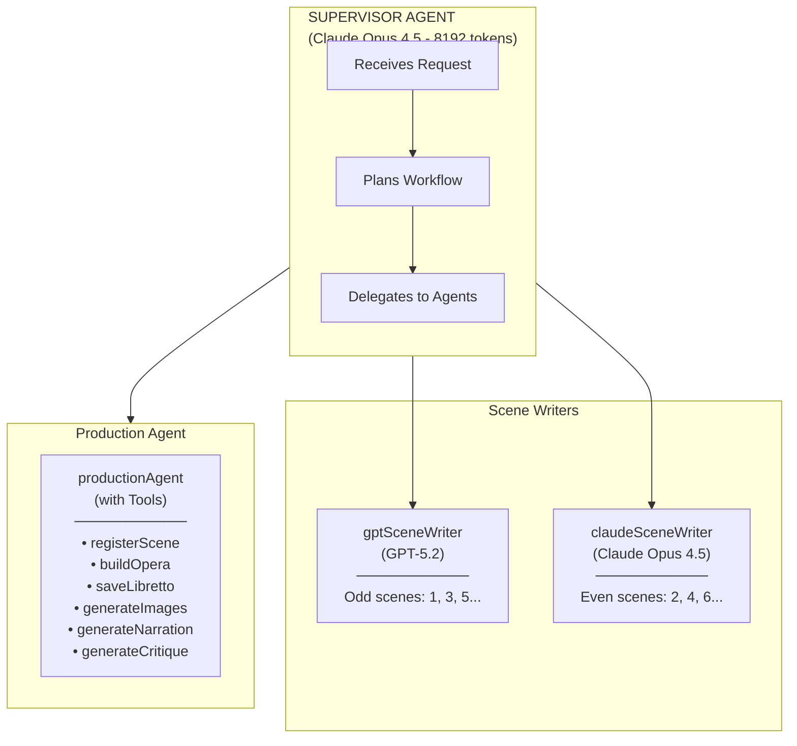
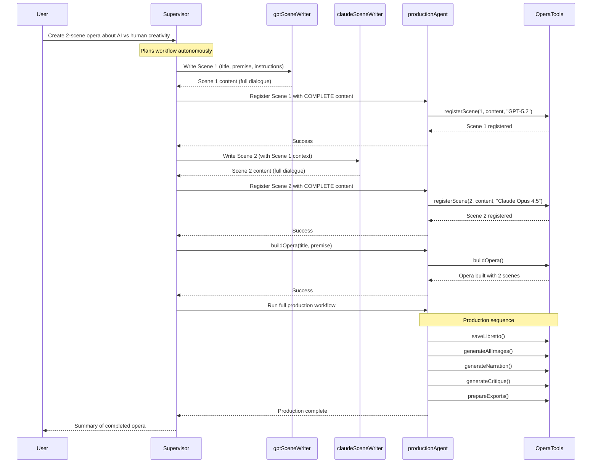
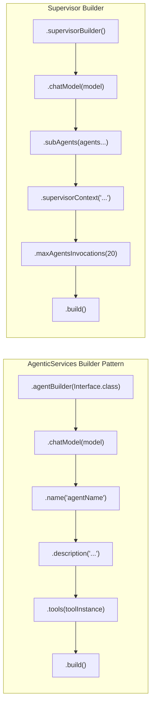
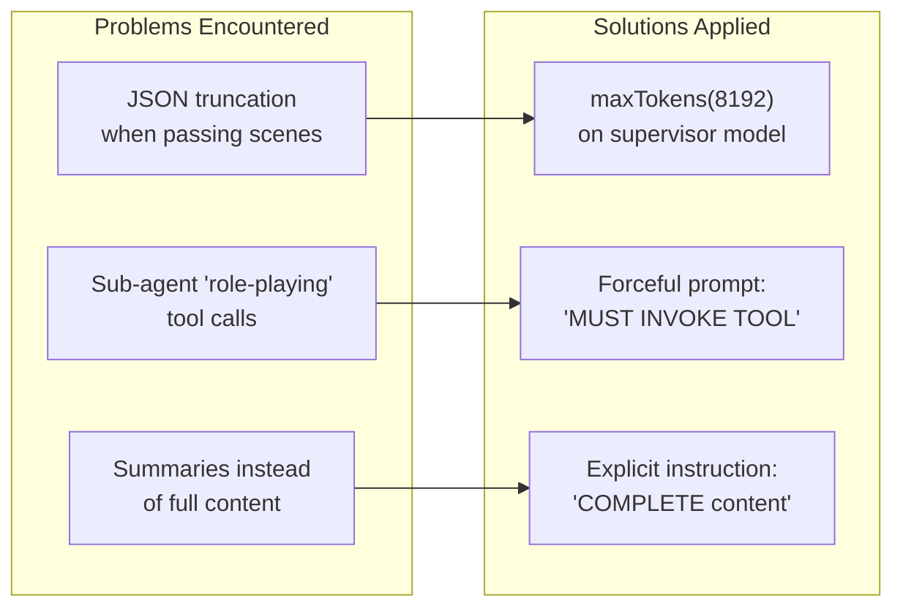
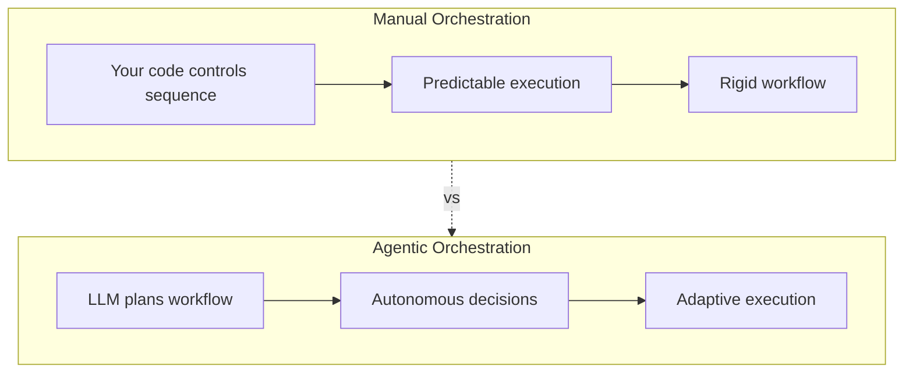

# Agentic Opera Generation Walkthrough

This document explains how the langchain4j-agentic supervisor pattern is used to orchestrate AI-powered opera generation.

## Architecture Overview

The system uses a **supervisor agent** that autonomously delegates to three specialized sub-agents:



## The Workflow Step-by-Step

### Step 1: User Request

```java
String request = "Create a 2-scene opera about the struggle between AI and human creativity.";
String result = generator.generateOperaAutonomously(request);
```

### Step 2: Supervisor Plans

The supervisor receives the request and **autonomously decides** what to do. It sees:
- Available agents and their capabilities
- Workflow instructions in `supervisorContext`
- The user's natural language request

It responds with JSON selecting the first agent:

```json
{
  "agentName": "gptSceneWriter$0",
  "arguments": {
    "title": "The Algorithm's Muse",
    "premise": "An opera exploring...",
    "sceneNumber": 1,
    "totalScenes": 2,
    "sceneInstructions": "Introduce the main characters..."
  }
}
```

### Step 3: Scene Writer Generates Content

The `SceneWriterAgent` interface defines what scene writers do:

```java
@UserMessage("""
    You are an expert opera librettist...
    Write Scene {{sceneNumber}} of {{totalScenes}}.
    {{sceneInstructions}}
    """)
@Agent(description = "Writes opera scenes with dramatic dialogue")
String writeScene(String title, String premise, String previousScenes,
                  int sceneNumber, int totalScenes, String sceneInstructions);
```

GPT-5.2 generates Scene 1 with full dialogue, stage directions, and character introductions.

### Step 4: Supervisor Registers the Scene

After receiving Scene 1, the supervisor calls `productionAgent` to store it:

```
Agent Invocation: productionAgent$2
Arguments: {request="Register scene 1 with COMPLETE content: [full scene]..."}
```

The `ProductionAgent` invokes the actual tool:

```java
@Tool("Register a scene that was generated by a scene writer")
public String registerScene(int sceneNumber, String sceneContent, String authorModel) {
    collectedScenes.add(new SceneData(sceneNumber, sceneContent, authorModel));
    return "Scene " + sceneNumber + " registered successfully.";
}
```

### Step 5: Alternate to Second Writer

Supervisor now calls `claudeSceneWriter` for Scene 2, passing context from Scene 1:

```json
{
  "agentName": "claudeSceneWriter$1",
  "arguments": {
    "previousScenes": "Scene 1: [The Studio Where Silence Learns to Speak] - Aria Vale...",
    "sceneNumber": 2,
    "sceneInstructions": "This is the FINAL scene. Bring the opera to conclusion..."
  }
}
```

Claude writes Scene 2 with continuity from Scene 1.

### Step 6: Build the Opera Object

After all scenes are registered, supervisor calls:

```
productionAgent: "buildOpera(The Algorithm's Muse, premise...)"
```

This creates the `Opera` record:

```java
@Tool("Build the Opera object from all registered scenes")
public String buildOpera(String title, String premise) {
    List<Opera.Scene> scenes = collectedScenes.stream()
        .sorted((a, b) -> Integer.compare(a.number(), b.number()))
        .map(data -> parseScene(data.number(), data.content(), data.author()))
        .toList();

    this.currentOpera = new Opera(title, premise, scenes);
    return "Opera built with " + scenes.size() + " scenes.";
}
```

### Step 7: Production Workflow

Finally, the supervisor triggers the full production:

```
productionAgent: "Run full production workflow"
```

This executes in sequence:

1. **saveLibretto** → Markdown file with formatted scenes
2. **generateAllImages** → Gemini creates illustrations (parallel)
3. **generateNarration** → ElevenLabs creates audio
4. **generateCritique** → Gemini reviews the opera
5. **prepareExports** → Suno prompts + NotebookLM package

### Step 8: Supervisor Returns Summary

The supervisor compiles a response summarizing what was accomplished.

## Complete Workflow Sequence



## Agent Configuration

The agents are built using `AgenticServices`:



### Code Example

```java
// Scene writers - different models for creative diversity
this.gptWriter = AgenticServices
    .agentBuilder(SceneWriterAgent.class)
    .chatModel(AiModels.GPT_5_2)
    .name("gptSceneWriter")
    .description("Writes opera scenes using GPT-5.2")
    .build();

this.claudeWriter = AgenticServices
    .agentBuilder(SceneWriterAgent.class)
    .chatModel(AiModels.CLAUDE_OPUS_4_5)
    .name("claudeSceneWriter")
    .description("Writes opera scenes using Claude Opus 4.5")
    .build();

// Production agent with tool access
this.productionAgent = AgenticServices
    .agentBuilder(ProductionAgent.class)
    .chatModel(supervisorModel)
    .name("productionAgent")
    .description("Handles production tasks")
    .tools(operaTools)  // ← Tools are attached here
    .build();

// Supervisor orchestrates everything
this.supervisor = AgenticServices
    .supervisorBuilder()
    .chatModel(AiModels.CLAUDE_OPUS_4_5_LARGE)  // 8192 tokens
    .subAgents(gptWriter, claudeWriter, productionAgent)
    .supervisorContext(workflowInstructions)
    .maxAgentsInvocations(20)
    .build();
```

## Key Lessons Learned

During development, we encountered and solved several issues:



| Issue | Symptom | Solution |
|-------|---------|----------|
| JSON truncation | `OutputParsingException` on large scenes | `maxTokens(8192)` on supervisor model |
| Role-playing tools | "Registered!" message but empty `collectedScenes` | Prompt: "YOU MUST INVOKE THE ACTUAL TOOL" |
| Content summarization | Libretto contained summaries, not full dialogue | Prompt: "COMPLETE content, not summaries" |

## The Power of Agentic Patterns



The key insight is that **the supervisor decides autonomously**. You give it a natural language request, and it:

- **Plans** the workflow based on available agents
- **Chooses** which agents to call and in what order
- **Maintains** state across multiple agent calls
- **Adapts** if something fails or needs adjustment
- **Reports** completion with a summary

This is fundamentally different from manual orchestration where your code controls every step explicitly.

## Running the Demo

```bash
# Agentic mode (default) - supervisor decides everything
./gradlew run

# Manual mode - code controls the workflow
./gradlew run --args="--manual"

# Custom agentic request
./gradlew run --args="'Create a 3-scene opera about time travel'"
```

## Generated Output

A successful run produces:

```
src/main/resources/the_algorithms_muse/
├── the_algorithms_muse_complete_libretto.md  # Full formatted libretto
├── scene_1_the_studio_where_silence_learns_to_speak.txt
├── scene_2_the_premiere_where_two_souls_become_one_voice.txt
├── scene_1_illustration.png                   # AI-generated artwork
├── scene_2_illustration.png
├── opera_introduction.mp3                     # ElevenLabs narration
├── scene_1_narration.mp3
├── the_algorithms_muse_critique.md            # Gemini review
├── suno_music_prompts.md                      # For Suno AI
└── notebooklm_package.md                      # For NotebookLM
```
