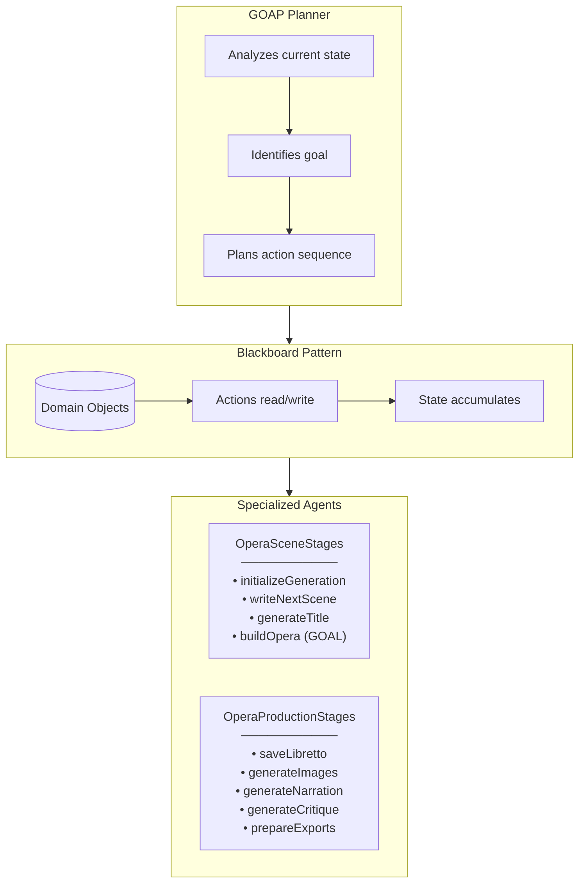
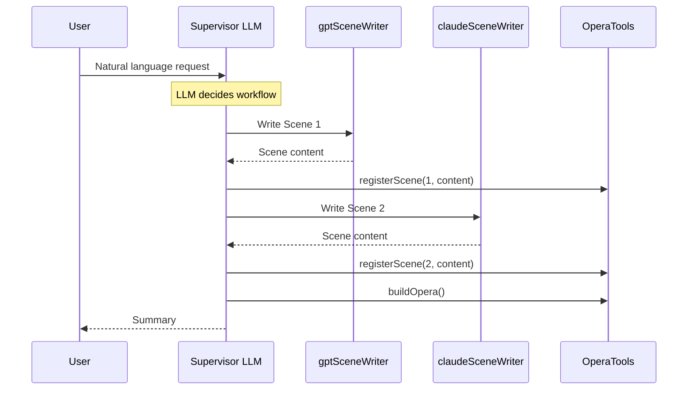
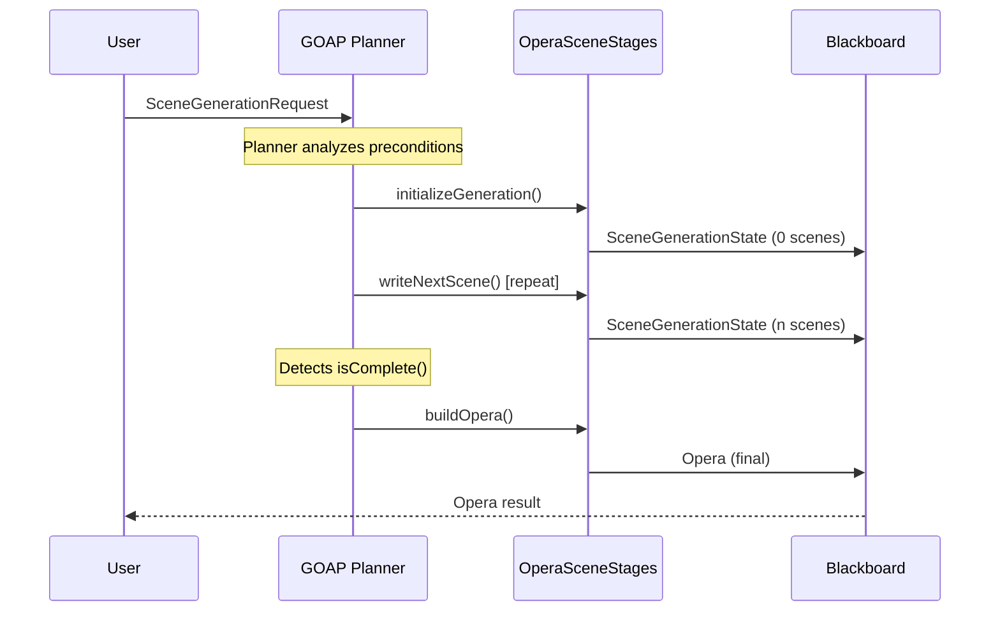
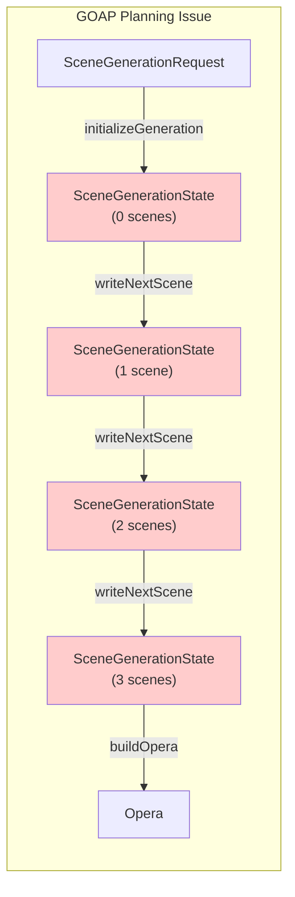
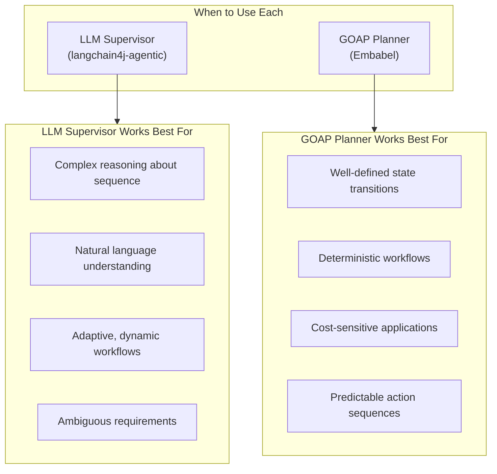

# Embabel Framework Walkthrough

This document explains the port from langchain4j-agentic to the Embabel agent framework and lessons learned.

## Architecture Overview

Embabel uses **GOAP (Goal-Oriented Action Planning)** with domain objects flowing through a **blackboard pattern**:



### Key Difference from langchain4j-agentic

| Aspect | langchain4j-agentic | Embabel |
|--------|---------------------|---------|
| **Orchestration** | Supervisor LLM decides | GOAP planner decides |
| **Agent Communication** | Supervisor passes messages | Domain objects on blackboard |
| **State Management** | Tools hold state | Domain records flow through |
| **Planning** | LLM reasoning | Automated precondition/effect matching |
| **Tool Invocation** | Sub-agent calls @Tool methods | Actions transform domain objects |

## The Embabel Approach

### Domain Objects

State flows through immutable records:

```java
// Request to start generation
public record SceneGenerationRequest(
    String title,
    String premise,
    int totalScenes
) {}

// Accumulated state during generation
public record SceneGenerationState(
    String title,
    String premise,
    int totalScenes,
    List<Opera.Scene> completedScenes
) {
    public int nextSceneNumber() { ... }
    public boolean isComplete() { ... }
    public SceneGenerationState withScene(Opera.Scene scene) { ... }
}
```

### Actions Transform State

```java
@Action(description = "Initialize scene generation state from a request")
public SceneGenerationState initializeGeneration(SceneGenerationRequest request) {
    return new SceneGenerationState(
        request.title(),
        request.premise(),
        request.totalScenes(),
        List.of()
    );
}

@Action(description = "Write the next opera scene using alternating AI models")
public SceneGenerationState writeNextScene(
    SceneGenerationState state,
    OperationContext context
) {
    // Generate scene, return new state with scene added
    return state.withScene(scene);
}
```

### Goals Mark Completion

```java
@AchievesGoal(description = "Complete scene generation by building the final Opera")
@Action(description = "Build the final Opera object from completed scenes")
public Opera buildOpera(SceneGenerationState state) {
    return new Opera(state.title(), state.premise(), state.completedScenes());
}
```

## Workflow Comparison

### langchain4j-agentic Flow



### Embabel Flow (Intended)



## What Worked: Manual Mode

Manual mode bypasses the GOAP planner entirely:

```java
// Shell command triggers manual workflow
@ShellMethod(value = "Generate an opera using alternating AI models", key = "generate-opera")
public String generateOpera(
    @ShellOption(defaultValue = "3") int scenes,
    @ShellOption(defaultValue = ShellOption.NULL) String title,
    @ShellOption(defaultValue = DEFAULT_PREMISE) String premise
) {
    // Directly call actions in sequence
    SceneGenerationState state = sceneStages.initializeGeneration(request);

    while (!state.isComplete()) {
        state = sceneStages.writeNextScene(state, null);  // null context = manual mode
    }

    Opera opera = sceneStages.buildOpera(state);
    return "Opera generated: " + opera.title();
}
```

### Successful Test Run

```
embabel> generate-opera
Initializing scene generation for 'null' with 3 scenes
Generating opera title...
Generated title: Vines of Hartford, Arias of Steel
Writing Scene 1 with GPT-5.2...
Completed Scene 1: 'The Charter Oak Awakes' by GPT-5.2
Writing Scene 2 with Claude Opus 4.5...
Completed Scene 2: 'The Insurance Cathedral Burns with Green' by Claude Opus 4.1
Writing Scene 3 with GPT-5.2...
Completed Scene 3: 'The Heart-Ford Rings' by GPT-5.2
Building opera 'Vines of Hartford, Arias of Steel' with 3 scenes

embabel> run-production
Production Status:
  Libretto:  ✓ (saved)
  Images:    ✓ (3 generated)
  Narration: ✓ (generated)
  Critique:  ✓ (generated)
  Exports:   ✓ (prepared)
```

## What Didn't Work: Agentic Mode

### The Problem

When invoking the agent autonomously via GOAP:

```java
@ShellMethod(value = "Create an opera using agentic workflow", key = "create-opera")
public String createOpera(@ShellOption(defaultValue = "3") int scenes) {
    var request = new OperaSceneStages.SceneGenerationRequest(null, DEFAULT_PREMISE, scenes);

    var result = agentInvocation.invoke(Opera.class)
        .input(request)
        .targetState(opera -> opera.scenes().size() >= scenes)
        .call();

    return result.toString();
}
```

The GOAP planner got "stuck":

```
GOAP Planner analyzing...
Current state: SceneGenerationRequest
Goal: Opera with 3+ scenes
Available actions:
  - initializeGeneration: SceneGenerationRequest → SceneGenerationState
  - writeNextScene: SceneGenerationState → SceneGenerationState
  - buildOpera: SceneGenerationState → Opera

Planning...
ERROR: No valid action sequence found
```

### Root Cause Analysis

The planner couldn't chain actions across the state transitions:



**The issue**: GOAP planners typically match action preconditions to effects. But:

1. `writeNextScene` has the **same input and output type** (`SceneGenerationState`)
2. The planner may not recognize that repeated calls accumulate state
3. The `isComplete()` condition is a **runtime check**, not a type-level distinction

### Potential Solutions (Untested)

1. **Distinct State Types**: Create separate types for each stage
   ```java
   record IncompleteState(...) {}
   record CompleteState(...) {}  // Only when all scenes done
   ```

2. **Loop Actions**: Some GOAP implementations support explicit loops
   ```java
   @Action(repeatable = true, until = "state.isComplete()")
   public SceneGenerationState writeNextScene(...)
   ```

3. **Hierarchical Planning**: Break into sub-goals
   ```java
   @AchievesGoal("Scene generation initialized")
   @AchievesGoal("All scenes written")  // Sub-goal
   @AchievesGoal("Opera built")  // Final goal
   ```

## Key Lessons Learned

### 1. GOAP ≠ LLM Supervisor

| langchain4j-agentic | Embabel GOAP |
|---------------------|--------------|
| LLM understands "repeat until done" | Planner needs explicit state types |
| Natural language reasoning | Formal precondition/effect matching |
| Flexible, adaptive | Rigid, type-driven |
| Token-expensive | Computationally cheap |

**Insight**: An LLM supervisor can reason about "do this 3 times" naturally. A GOAP planner needs each iteration to produce a distinct state type or have explicit loop constructs.

### 2. Domain Object Design Matters

For GOAP to work, domain objects should:
- Have **distinct types** for each planning stage
- Make **completion conditions** visible at the type level
- Avoid **same-type-in-same-type-out** patterns for iterative operations

### 3. Manual Mode is Valuable

Even when agentic mode fails, the same agents work perfectly in manual mode. This provides:
- A working fallback
- A way to test and debug actions
- Confidence in the core logic

### 4. Spring Integration Requires Care

Embabel's Spring integration has specific requirements:
- **Model names** must match the registry (`gpt-5`, not `gpt-5.2`)
- **GPT-5** only supports `temperature = 1.0`
- **OperationContext** is null in manual mode; inject `Ai` directly
- **Shell history** conflicts with log files; configure separately

### 5. Different Problems, Different Tools



## Running the Demo

```bash
# Build the application
./gradlew clean bootJar

# Start the shell (NOT ./gradlew bootRun - it exits immediately)
java -jar build/libs/OperaGenerator-1.0.jar

# Manual mode (working)
embabel> generate-opera              # Default: 3 scenes
embabel> generate-opera -s 5         # Custom scene count
embabel> run-production              # Generate all artifacts

# Agentic mode (currently broken - GOAP planning issue)
embabel> create-opera -s 3
```

## Conclusion

The Embabel port demonstrated that:

1. **The core agent logic is sound** - manual mode works perfectly
2. **GOAP planning has specific requirements** - iterative workflows need careful state design
3. **Different orchestration patterns suit different problems** - LLM supervisors handle ambiguity; GOAP handles determinism
4. **Framework-specific knowledge matters** - model names, temperature constraints, and Spring integration all have gotchas

The langchain4j-agentic approach succeeded because an LLM can reason about "call writeScene repeatedly until done." The Embabel GOAP approach needs either:
- Distinct types for each iteration state, OR
- Explicit loop/repeat constructs in the planning language

This is a fundamental difference in how the two systems approach workflow orchestration.
