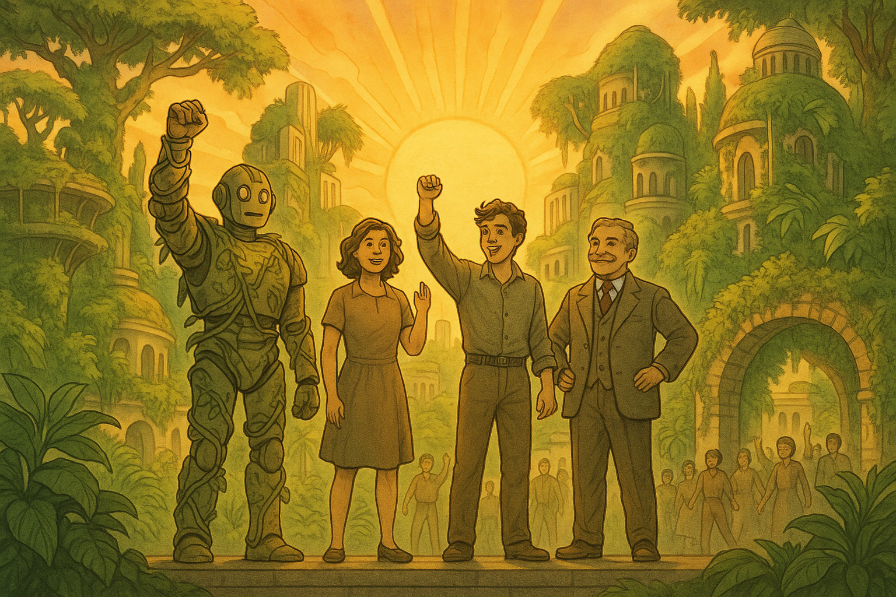
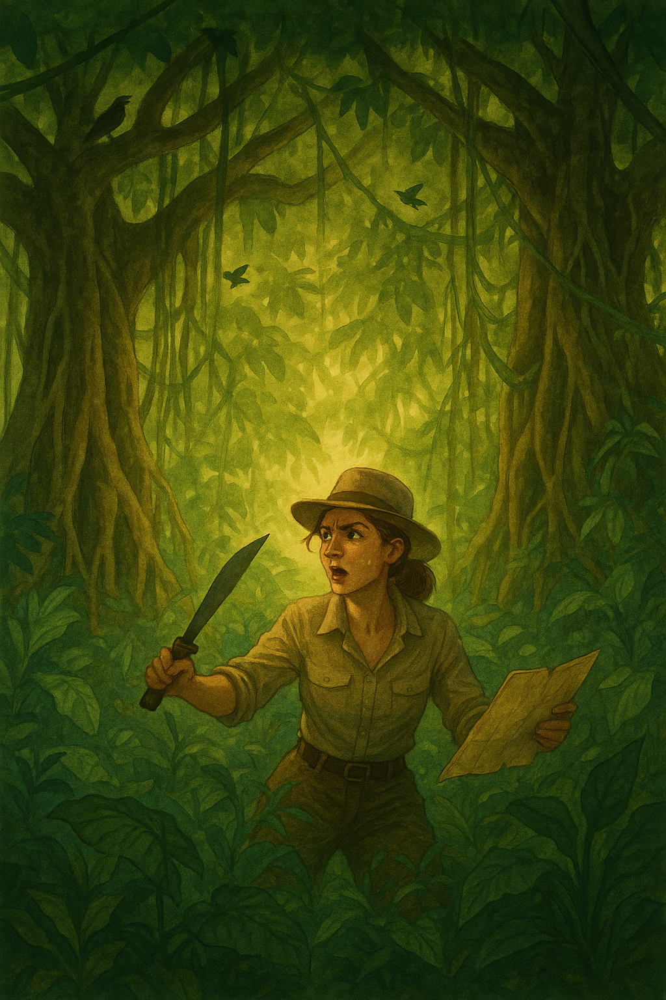
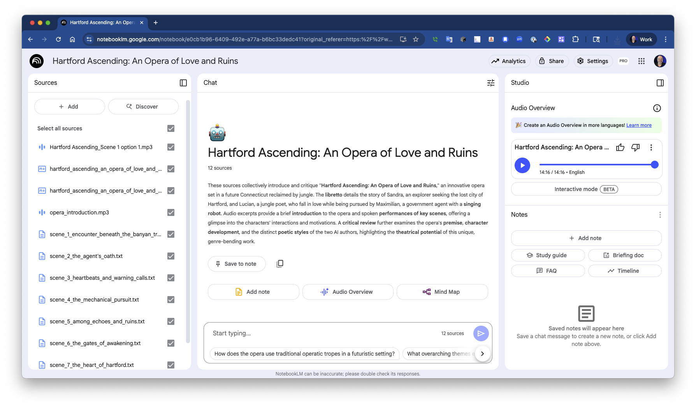

# AI Opera Generator
## Multiple LLMs in Concert 🎭

<div class="pt-12">
  <span @click="$slidev.nav.next" class="px-2 py-1 rounded cursor-pointer" hover="bg-white bg-opacity-10">
    Let's compose an AI-powered opera! <carbon:arrow-right class="inline"/>
  </span>
</div>

<div class="abs-br m-6 flex gap-2">
  <a href="https://github.com/kousen/OperaGenerator" target="_blank" alt="GitHub"
    class="text-xl slidev-icon-btn opacity-50 !border-none !hover:text-white">
    <carbon-logo-github />
  </a>
</div>

---

# Contact Info

Ken Kousen<br>
Kousen IT, Inc.

- ken.kousen@kousenit.com
- http://www.kousenit.com
- http://kousenit.org (blog)
- Social Media:
  - [@kenkousen](https://twitter.com/kenkousen) (Twitter)
  - [@kousenit.com](https://bsky.app/profile/kousenit.com) (Bluesky)
  - [https://www.linkedin.com/in/kenkousen/](https://www.linkedin.com/in/kenkousen/) (LinkedIn)
- *Tales from the jar side* (free newsletter)
  - https://kenkousen.substack.com
  - https://youtube.com/@talesfromthejarside

---

# The Premise 🎵

<v-clicks>

> "They say that all operas are about a soprano who wants to sleep with the tenor, but the baritone won't let her."

- The wild jungles of Connecticut (post climate change)
- A soprano explorer searching for lost Hartford
- A tenor poet living with the monkeys
- A baritone government agent with a singing robot
- An AI system to write it all...

</v-clicks>

---

# The AI Orchestra 🎼

<div style="position: absolute; top: 60px; right: 40px; opacity: 0.9;">
  
</div>

<v-clicks>

- **Text Generation**: GPT-4.1 + Claude Sonnet 4 writing scenes
- **Image Generation**: OpenAI's gpt-image-1 creating illustrations  
- **Music Generation**: Suno AI composing arias
- **Voice Narration**: ElevenLabs reading stage directions
- **Audio Content**: NotebookLM discussing the opera
- **Critical Review**: Gemini 2.5 Flash as opera critic
- **All Orchestrated** with Modern Java

</v-clicks>

<br>

```java
// Java conducts the AI ensemble
Opera opera = conversation.generateOpera("Hartford Ascending", 5);
OperaImageGenerator.generateImages(opera);
OperaCritic.review(opera);
// Plus: Suno for music, NotebookLM for podcast
```

---
layout: section
---

# Lesson 1
## Orchestrating Multiple LLMs

---

# The Challenge: AI Collaboration

<v-clicks>

Traditional approach: One model, one task

```java
// Boring! Same voice throughout
ChatLanguageModel model = OpenAiChatModel.builder()
    .apiKey(apiKey)
    .modelName("gpt-4.1")
    .build();
```

Our approach: Multiple models alternating scenes

```java
// Exciting! Different perspectives
ChatLanguageModel gpt4 = createGptModel();
ChatLanguageModel claude = createClaudeModel();

// Alternate between them for variety
model = (i % 2 == 0) ? gpt4 : claude;
```

</v-clicks>

---

# Enter LangChain4j 🔗

<v-clicks>

**The Java Framework for AI Integration**

- **Unified API** - Same interface for OpenAI, Anthropic, Google, etc.
- **Memory Management** - Built-in conversation history
- **Modern Java** - Records, virtual threads, functional style
- **Production Ready** - Error handling, retries, timeouts

```java
// One interface, multiple models
ChatLanguageModel gpt = OpenAiChatModel.builder()
    .apiKey(apiKey).modelName("gpt-4.1").build();

ChatLanguageModel claude = AnthropicChatModel.builder()  
    .apiKey(apiKey).modelName("claude-sonnet-4-20250514").build();

// Same methods, different providers!
String response1 = gpt.generate("Write an opera scene");
String response2 = claude.generate("Continue the story");
```

</v-clicks>

---

# Setting Up Multiple Models

```java
public class AiModels {
    public static ChatLanguageModel getOpenAiModel() {
        return OpenAiChatModel.builder()
            .apiKey(ApiKeys.OPENAI_API_KEY)
            .modelName("gpt-4.1")
            .temperature(0.7)
            .timeout(ofSeconds(60))
            .build();
    }
    
    public static ChatLanguageModel getAnthropicModel() {
        return AnthropicChatModel.builder()
            .apiKey(ApiKeys.ANTHROPIC_API_KEY)
            .modelName("claude-sonnet-4-20250514")
            .temperature(0.7)
            .build();
    }
}
```

---
layout: section
---

# Lesson 2
## Managing Shared Memory 🧠

---

# The Memory Challenge

<v-clicks>

Problem: How do different models maintain context?

- Each API call is stateless
- Models need to know what happened before
- Characters must remain consistent
- Story must flow naturally

Solution: **ChatMemory** from LangChain4j!

</v-clicks>

---

# Implementing Shared Memory

<div class="grid grid-cols-2 gap-6">

<div>

**The Pattern**
- Start with premise
- Alternate between models  
- Each sees full history
- Memory auto-manages

</div>

<div>

```java
public class Conversation {
    private final ChatMemory memory = 
        MessageWindowChatMemory
            .withMaxMessages(20);
    
    public Opera generateOpera(String title, int scenes) {
        // Add premise
        memory.add(new SystemMessage(PREMISE));
        
        for (int i = 1; i <= scenes; i++) {
            // Alternate models
            var model = (i % 2 == 1) 
                ? AiModels.getOpenAiModel() 
                : AiModels.getAnthropicModel();
            
            // Generate with full context
            var response = model.generate(memory.messages());
            memory.add(response.content());
        }
    }
}
```

</div>

</div>

---

# Memory in Action

<v-clicks>

**Scene 1** (GPT-4): Sandra meets Lucian
```
SANDRA: Who are you, spirit or man?
LUCIAN: I am Lucian. Here I dwell...
```

**Scene 2** (Claude): Government agent appears
```
MAXIMILIAN: Sandra Greaves! Your trespass ends today!
(He remembers Sandra from Scene 1)
```

**Scene 3** (GPT-4): Romance develops
```
SANDRA & LUCIAN: (They remember their meeting)
In this green cathedral, love takes root...
```

</v-clicks>

---
layout: section
---

# Lesson 3
## AI Comedy Through Absurdity 😄

---

# The Humor Formula

<v-clicks>

AI models aren't naturally funny, BUT...

Give them an absurd premise → Watch them commit 100%

```java
String PREMISE = """
    The wild jungles of Connecticut...
    A tenor poet composing symphonies for monkeys...
    A giant robot that sings Verdi in three languages...
    """;
```

Result: Unintentional comedy gold!

</v-clicks>

---

# Examples of AI Commitment to Absurdity

<v-clicks>

**The Robot's Aria** (Scene 4):
```
ARIA-7 ROBOT (bass, mechanical tremolo):
> VITA È DOLORE! LIFE IS PAIN! LA VIE EST DOULEUR!<br>
> CRUSH THE HEARTS THAT DARE REBEL!<br>
> SCHIACCIARE! DESTROY! ÉCRASER!<br>
> SINGING IS MY PROTOCOL OF HELL!
```

**Lucian's Monkey Symphony** (Scene 3):
```
LUCIAN: I've taught the howler monkeys Puccini,
        The marmosets know Mozart's every note!
```

</v-clicks>

---
layout: section
---

# Lesson 4
## Modern Java + AI 🚀

---

# Java 21 Features in Action

<v-clicks>

## Records for Domain Modeling

```java
public record Opera(
    String title,
    String premise,
    List<Scene> scenes
) {
    public record Scene(
        int number,
        String title,
        String content,
        String author
    ) {
        public String getFileName() {
            return String.format("scene_%d_%s.txt", 
                number, 
                title.toLowerCase().replaceAll("\\W+", "_")
            );
        }
    }
}
```

</v-clicks>

---

# Virtual Threads for Concurrent APIs

```java
public static void generateImages(Opera opera) {
    Semaphore rateLimiter = new Semaphore(2); // Max 2 concurrent
    
    try (var executor = Executors.newVirtualThreadPerTaskExecutor()) {
        var futures = opera.scenes().stream()
            .map(scene -> CompletableFuture.runAsync(() -> {
                try {
                    rateLimiter.acquire();
                    Thread.sleep(1000); // Rate limiting
                    generateImage(scene);
                } finally {
                    rateLimiter.release();
                }
            }, executor))
            .toList();
            
        CompletableFuture.allOf(futures.toArray(new CompletableFuture[0])).join();
    }
}
```

<v-click>

✨ Virtual threads = Thousands of concurrent operations with ease!

</v-click>

---

# Pattern Matching & Text Blocks

```java
// Pattern matching for response handling
switch (response) {
    case ImageResponse(var url, null) -> 
        saveImageFromUrl(url, scene);
    case ImageResponse(null, var b64) -> 
        saveImageFromBase64(b64, scene);
    default -> 
        throw new RuntimeException("Unexpected response");
}

// Text blocks for prompts
String scenePrompt = """
    Write Scene %d of the opera.
    
    Remember:
    - %s is searching for Hartford
    - The robot can sing in multiple languages
    - Make it dramatic and slightly absurd
    """.formatted(sceneNumber, soprano);
```

---
layout: section
---

# Bonus Lessons
## From Development Journey 🎯

---

# API Evolution & Resilience

<v-clicks>

**Problem**: OpenAI changed their API (URLs → Base64)

```java
// Old DALL-E 3
ImageResponse(String url, String revisedPrompt)

// New gpt-image-1  
ImageResponse(String b64Json, null)  // No URL, no prompt!
```

**Solution**: Adapt quickly, test thoroughly

```java
@Test
void exploreGptImageModels() {
    var response = model.generate("A soprano in the jungle");
    
    assertThat(response.content().url()).isNull();
    assertThat(response.content().base64Data()).isNotNull();
}
```

</v-clicks>

---

# Rate Limiting Done Right

<v-clicks>

**Problem**: Too many concurrent requests = 429 errors

**Solution**: Semaphore + Virtual Threads

```java
Semaphore rateLimiter = new Semaphore(maxConcurrent);

// Elegant rate limiting
rateLimiter.acquire();
try {
    // Make API call
    Thread.sleep(delayBetweenRequests);
} finally {
    rateLimiter.release();
}
```

Benefits:
- No external libraries needed
- Scales with virtual threads
- Easy to tune

</v-clicks>

---

# Test-Driven AI Development

<v-clicks>

**Challenge**: Continue an unfinished opera

```java
@Test
void continueHartfordOpera() {
    // 1. Read existing opera context
    String existingStory = readLibretto("hartford_act1.md");
    
    // 2. Create continuation prompt with context
    String continuation = PREMISE + """
        The story so far: [summary]
        Continue from Scene 6...
        """;
    
    // 3. Generate remaining scenes
    Opera part2 = conversation.generateOpera(
        "Hartford Ascending", continuation, 3
    );
    
    // 4. Merge and save complete opera
    mergeOperas(part1, part2);
}
```

</v-clicks>

---

# Adding Voice Narration 🎤

<v-clicks>

**Problem**: Opera has dramatic stage directions

```
[The stage is lush and green, tangled with vines and enormous leaves. 
Birds call from above, and shafts of golden sunlight pierce the green gloom.]
```

**Solution**: ElevenLabs + Java HttpClient

```java
private Path generateAudio(String text, String voiceId, Path outputPath) throws IOException {
    var request = HttpRequest.newBuilder()
        .uri(URI.create(API_URL + voiceId))
        .header("xi-api-key", ELEVEN_LABS_API_KEY)
        .header("Content-Type", "application/json")
        .POST(HttpRequest.BodyPublishers.ofString(jsonBody))
        .build();
    
    // Stream directly to file - no intermediate memory!
    var response = client.send(request, HttpResponse.BodyHandlers.ofFile(outputPath));
    
    return outputPath;
}

// And then play it live!
AudioPlayer.play(audioFile);
```

</v-clicks>

---

# The AI Opera Critic 🎭

<div style="position: absolute; top: 20px; right: 20px; opacity: 0.9;">
  
</div>

<v-clicks>

**Problem**: Every opera needs a critic's review

**Solution**: Gemini 2.5 Flash as Anton Ego

```java
public class OperaCritic {
    private final ChatLanguageModel model = GoogleAiGeminiChatModel.builder()
        .apiKey(ApiKeys.GOOGLEAI_API_KEY)
        .modelName("gemini-2.0-flash-exp")
        .temperature(0.8)  // More creative for criticism
        .build();
    
    public void reviewAndSave(Path operaDir, String operaTitle) {
        String prompt = """
            You are a distinguished opera critic in the tradition of 
            the great critics of the past. Review this AI-generated opera 
            with wit, insight, and perhaps a touch of theatrical flair...
            """;
    }
}
```

</v-clicks>

---

# AI Critic in Action 📰

<v-clicks>

**Sample Review** (Gemini 2.5 Flash on Hartford Ascending):

> *"Hartford Ascending is a triumph of absurdist opera, blending environmental catastrophe with mechanical madness in a way that only AI could conceive..."*

> *"The robot's multilingual arias are particularly memorable, though one wonders if Verdi is spinning in his grave..."*

> *"This fearless embrace of the bizarre creates something genuinely entertaining."*

**Key Features**:
- Understands opera conventions and traditions
- Provides both praise and constructive criticism  
- Captures the theatrical voice of a seasoned critic
- Saves review as markdown alongside the opera

</v-clicks>

---

# AI Podcast with NotebookLM 🎙️

<div style="position: absolute; top: 20px; right: 20px; opacity: 0.9;">
  
</div>

<v-clicks>

**Problem**: Need expert analysis of our AI-generated opera

**Solution**: NotebookLM creates AI podcast hosts

- Upload **all opera files** (libretto, scenes, critique, images)
- NotebookLM **analyzes everything** 
- Generates **14+ minute podcast** with two AI hosts
- Discusses themes, characters, artistic merits
- **"Two Guys Talking"** format about our opera

```bash
# What NotebookLM received:
- Complete 8-scene libretto
- Individual scene files  
- Critical review
- Audio narration files
- Scene illustrations
```

**Result**: Professional analysis of Hartford Ascending! 🎭

</v-clicks>

---

# Automated Formatting = Time Saved

<v-clicks>

**Problem**: Manual formatting of 500+ lines of opera

**Solution**: Format on save!

```java
private static String formatSceneContent(String content) {
    // Detect character lines: "SANDRA (crying):"
    Matcher m = SINGING_PATTERN.matcher(line);
    if (m.matches()) {
        String character = m.group(1);
        String voiceType = determineVoiceType(character);
        
        // Auto-format with voice type
        result.append("**").append(character).append("** (")
              .append(voiceType).append("):\n");
    }
    
    // Convert lyrics to blockquotes
    if (inLyricSection) {
        result.append("> ").append(line).append("<br>\n");
    }
}
```

</v-clicks>

---
layout: center
---

# Live Demo! 🎭

Let's generate and play an opera together...

<v-clicks>

**The Complete Workflow:**
1. Generate scene with GPT-4.1/Claude Sonnet 4 ✅
2. Create illustration with gpt-image-1 ✅ 
3. Generate narrator audio with ElevenLabs ✅
4. **Play the audio live!** 🎵 ✅
5. **Plus: Suno AI opera music** 🎼 ✅

```bash
# Generate and play narrator in one command
./gradlew test --tests AudioDemoTest::generateAndPlayOperaIntroduction

# Then play actual opera music from Suno AI
# (Sandra and Lucian's duet from Scene 1)
```

</v-clicks>

---

# The Complete AI Orchestra 🎼

<div style="position: absolute; top: 60px; right: 20px; opacity: 0.85;">
  
</div>

<div class="grid grid-cols-2 gap-6">

<div>

**Automated Pipeline** (Java)
- GPT-4.1: Odd scenes ✅
- Claude Sonnet 4: Even scenes ✅
- gpt-image-1: All illustrations ✅
- ElevenLabs: Narrations ✅
- Gemini 2.5 Flash: Critique ✅

</div>

<div>

**External Enrichment**
- **Suno AI**: Opera music ✅
- **NotebookLM**: 14-min AI podcast ✅
- **Live Performance**: Java orchestration

</div>

</div>

<br>

<v-click>

**Result**: Complete multimedia opera experience! 🎭

**🎵 AI narrator • 🎼 Opera music • 🎨 Scene art • 📖 8-scene libretto**

</v-click>

---

# The Complete Opera

<div class="grid grid-cols-2 gap-4">

<div>

**"Hartford Ascending"**

- 8 Scenes
- 4 Character voices
- 2 AI authors alternating
- 1 Shared memory
- 0 Manual interventions

</div>

<div>

```
📁 hartford_ascending/
├── 📄 complete_libretto.md
├── 🎨 scene_1_illustration.png
├── 🎨 scene_2_illustration.png
├── ...
├── 🎨 scene_8_illustration.png
└── 📰 critique.md
```

</div>

</div>

<v-click>

<br>

**Total Generation Time**: ~10 minutes

**Manual Work Required**: Zero!

</v-click>

---

# Key Takeaways

<v-clicks>

1. **Multiple LLMs** create richer content through variety

2. **Shared Memory** maintains coherence across models

3. **Absurd Premises** + AI commitment = Comedy gold

4. **Modern Java** makes AI integration elegant

5. **Rate Limiting** prevents API throttling

6. **Automation** saves hours of manual work

7. **Test-Driven** approach works great for AI features

8. **AI Orchestra** approach multiplies creative possibilities

9. **Live Audio Demos** make presentations unforgettable

10. **Working end-to-end** beats theoretical examples every time

</v-clicks>

---

# The AI Orchestra Pattern 🎼

<v-clicks>

## Each AI tool is like an instrument:

- **GPT-4.1/Claude Sonnet 4**: The composers (libretto)
- **gpt-image-1**: The set designer (visuals)
- **Suno**: The musicians (musical arias)
- **ElevenLabs + JLayer**: The narrator (stage directions + playback)
- **NotebookLM**: The podcast hosts (analysis)
- **Gemini 2.5 Flash**: The reviewer (critique)
- **Java**: The conductor (orchestration)

## Key insight:
**Don't use one AI for everything.**  
**Use the best AI for each specific task!**

</v-clicks>

---

# APIs & Technologies 🛠️

<v-clicks>

## AI APIs Used (All Working!)
- **OpenAI**: GPT-4.1 & gpt-image-1 ✅
- **Anthropic**: Claude Sonnet 4 ✅
- **Google**: Gemini 2.5 Flash ✅  
- **ElevenLabs**: Voice narration ✅
- **Suno AI**: Opera music ✅

## Java Features Showcased
- **Virtual Threads** (JDK 21) ✅
- **Records & Pattern Matching** ✅
- **Text Blocks** ✅
- **HttpClient** (JDK 11+) ✅
- **JLayer** for Audio Playback ✅

</v-clicks>

---
layout: default
---

# Resources & Links 📚

<v-clicks>

## Code & Documentation
- **GitHub**: [github.com/kousen/OperaGenerator](https://github.com/kousen/OperaGenerator)
- **LangChain4j**: [docs.langchain4j.dev](https://docs.langchain4j.dev)
- **Slidev**: [sli.dev](https://sli.dev) (for this presentation)

## Hartford Ascending Assets
- **AI-Generated Podcast**: [NotebookLM Discussion](./src/main/resources/hartford_ascending_an_opera_of_love_and_ruins/Hartford%20Ascending_Scene%201%20option%201.mp3) (14+ minutes)
- **Complete Libretto**: Available in the GitHub repository
- **Scene Illustrations**: All 8 AI-generated images included

## Try It Yourself
- Clone the repository
- Set your API keys
- Run: `./gradlew test --tests AudioDemoTest`
- Generate your own AI opera! 🎭

</v-clicks>

---
layout: center
class: text-center
---

# Thank You! 🎭

Questions?

<div class="mt-8">

**GitHub Issues for feature requests**  
**Contributions welcome!**  
**Let's discuss AI orchestration!**

</div>

<br>

Ken Kousen  
[@kousenit.com](https://bsky.app/profile/kousenit.com)  
[ken.kousen@kousenit.com](mailto:ken.kousen@kousenit.com)

<br>

<div class="abs-br m-6 flex gap-2">
  <a href="https://github.com/kousen/OperaGenerator" target="_blank" alt="GitHub"
    class="text-xl slidev-icon-btn opacity-50 !border-none !hover:text-white">
    <carbon-logo-github />
  </a>
</div>