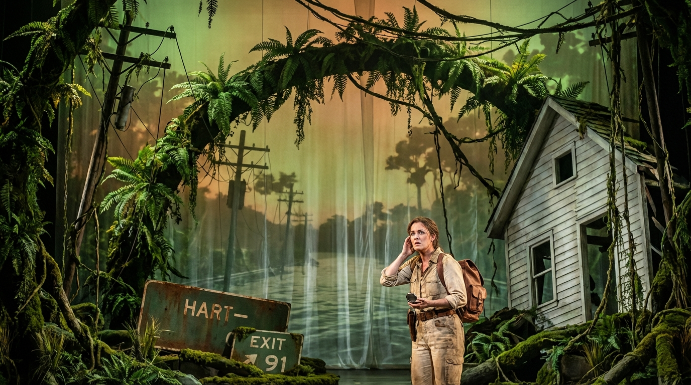
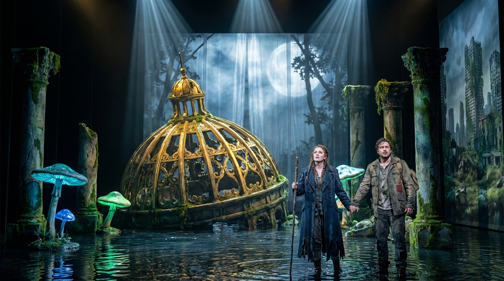

# Agentic Test

## Premise

They say that all operas are about a soprano
who wants to sleep with the tenor, but the
baritone won't let her. See, for example, La Traviata,
Rigoletto, or Carmen.

You are composing the libretto for such an opera.

The setting is the wild jungles of Connecticut,
in the not-so-distant future after global warming has
reclaimed the land. The soprano is an intrepid
explorer searching for the lost city of Hartford.
The tenor is a native poet who has been living in
the jungle for years, writing sonnets to the trees and
composing symphonies for the monkeys.

The baritone is a government agent who has been sent
to stop the soprano from finding the lost city. He
has a secret weapon: a giant robot that can sing
Verdi arias in three different languages.

The soprano and the tenor meet in the jungle and
fall in love. They decide to join forces and find
the lost city together. But the baritone is always
one step behind them, and his giant robot is getting
closer and closer.

---

### Scene 1: [Green Cathedrals of Connecticut]

> **Author: GPT-5.2**

[The curtain rises slowly. A jungle has swallowed what was once suburban Connecticut. Enormous ferns arch like cathedral vaults. Vines hang from snapped power lines. Half-buried street signs read: “HART—” and “EXIT 91” in rusted ghost-letters. The air steams. In the distance, a drowned highway becomes a river; frogs sing in polyrhythm with far-off monkeys. A broken white clapboard house leans like a tired hymn.]

[From the canopy comes a low, metallic resonance—too distant to name. It fades into wind.]

[Enter ARIA QUINN (SOPRANO), an explorer in sun-bleached gear, compass in hand, a battered map case strapped to her chest. She moves with reverence and hunger, as if listening for a city’s heartbeat.]

**ARIA QUINN** (voice):
> O green, unending syllable of earth— 
> Connecticut, remade in fevered rhyme! 
> The atlas lied, the satellites went blind, 
> and yet the rumor of a city sings.

[She kneels, brushes moss from a stone foundation. A glint: a brass letter “H” from an old municipal plaque.]

**ARIA QUINN** (voice):
> Hartford… my vanished consonant, my prize— 
> they said you sank beneath the summers’ roar, 
> that ivy learned your avenues by touch, 
> that rivers took the names of streets for themselves.

[She stands, lifts the “H” like a relic.]

**ARIA QUINN** (voice):
> If I can find your pulse beneath these roots, 
> I’ll prove the world has not forgotten maps. 
> I’ll drag you into dawn with both my hands— 
> and write my name in your recovered breath!

[A sudden burst of birdcall. The jungle answers with an echo, as if someone has mimicked it. ARIA freezes, then smiles—heard but unseen.]

**ARIA QUINN** (voice):
> Who shadows me with music? Show your face— 
> or are you only leaf and listening?

[A soft figure appears between curtains of vine.]

[Enter ELIAS THORN (TENOR), a native poet, bare-armed, ink-stained fingers, carrying a carved wooden flute and a bundle of paper wrapped in oilcloth. He moves with the ease of one who has learned the jungle’s meter.]

**ELIAS THORN** (voice):
> Not leaf—though I have borrowed leaf’s green tongue. 
> Not listening—though the forest taught my ear. 
> I am a man who stayed when roads dissolved, 
> who learned to read the weather like a score.

**ARIA QUINN** (voice):
> A voice… that doesn’t fear to stand alone. 
> Are you a guardian? A thief? A guide?

**ELIAS THORN** (voice):
> A poet, if the word still has a home. 
> I give the monkeys counterpoint at noon; 
> I set the rain to verse in minor keys. 
> And you—your boots speak “north” with every step.

**ARIA QUINN** (voice):
> I am ARIA QUINN—cartographer of loss, 
> hunter of Hartford’s swallowed clock-tower. 
> I seek a city no one dares to name 
> without a laugh, a prayer, or government ink.

**ELIAS THORN** (voice):
> Hartford… [He tastes the word, reverent.] 
> The old mouth of the river, closed with vines. 
> They warned you: every myth has teeth.

**ARIA QUINN** (voice):
> Then let it bite. I’ve come with sharper blood. 
> I’ve traded comfort for the right to know. 
> I will not turn—no, not for swamp or law.

[ELIAS studies her map case, the compass, the “H.” He is struck—not by her tools, but by her certainty.]

**ELIAS THORN** (voice):
> You carry hunger like a lantern flame. 
> It makes the shadows honest. 
> What is it you believe waits there— 
> gold? archives? a throne of drowned insurance?

**ARIA QUINN** (voice):
> A truth. 
> A place where all my questions stand upright. 
> If Hartford breathes, then so can I.

**ELIAS THORN** (voice):
> Then let my words become your rope. 
> I know the paths that don’t exist on paper: 
> the ridge of granite under moss, 
> the stumps that mark an old commuter line, 
> the stones that still remember human feet.

**ARIA QUINN** (voice):
> You would guide me?

**ELIAS THORN** (voice):
> I would walk beside you— 
> and if the jungle asks your name in thunder, 
> I’ll answer with a sonnet.

[They circle each other, wary and drawn. The air seems to hush around them, as if the jungle itself leans closer.]

**ARIA QUINN** (voice):
> Then take my vow. 
> No map alone can birth a city back. 
> But two voices—two—can call a ruin home.

**ELIAS THORN** (voice):
> Two voices… [He lifts his flute, plays a short, plaintive phrase that mimics a distant train whistle, then turns it into birdsong.] 
> Hear that? The forest keeps old melodies 
> and begs new mouths to finish them.

**ARIA QUINN** (voice):
> Your music… it’s as if the vines have learned to love.

[Their hands nearly touch—then the ground trembles. A faint, far-off chord in Verdi’s style rolls through the trees, impossibly precise. It is sung by something not alive.]

[Lights shift: a cold, searching beam sweeps across the foliage from offstage, as if a mechanical eye is scanning.]

**ELIAS THORN** (voice):
[Low, urgent]  
Don’t move. That is not thunder.

**ARIA QUINN** (voice):
> What is it?

**ELIAS THORN** (voice):
> The government sent its hymn of iron. 
> A metal throat that knows three tongues of grief.

[From the distance, a giant, disembodied baritone line—perfectly trained—blooms through speakers unseen, as if the jungle itself has become an opera house. The aria is Verdi-like, but distorted by the wilderness: Italian syllables braided with English and Spanish.]

**ROBOT VOICE** (bass, offstage, amplified):
> “Di—ri—tto… of duty… ¡obediencia! 
> Il cuore—must—be—controlled…”

[ARIA’s breath catches. ELIAS pulls her gently behind a fallen porch beam overgrown with orchids.]

**ARIA QUINN** (voice):
> A robot… singing?

**ELIAS THORN** (voice):
> A hunter with a conservatory soul. 
> It listens for footfalls, for fear, for names. 
> If it finds you, it will call you “citizen” 
> and chain your dreams in paperwork.

**ARIA QUINN** (voice):
> Then someone—someone knows I’m here.

**ELIAS THORN** (voice):
> Yes. 
> And he will come—not with machete, 
> but with law sharpened into a blade.

[As if answering, a human voice—close enough to chill the spine—cuts through the mechanical aria: calm, official, smiling.]

[Enter AGENT SILAS GRAVES (BARITONE), in a sleek, weatherproof coat bearing a faded government seal. He does not yet see them. He speaks into a wrist device, measured and intimate, as if whispering orders to a beloved.]

**SILAS GRAVES** (voice):
> Unit VERDI-3, continue the sweep. 
> Modulate to the trees— 
> they echo everything in this wet world. 
> If the explorer sings, I want her pitch.

[The robot’s distant aria shifts key obediently. The beam of light passes nearer.]

**ELIAS THORN** (voice):
[Whispered]  
That is Graves.  
He cages wonders and calls it “safety.”

**ARIA QUINN** (voice):
[Whispered, fierce]  
He won’t cage me.

**ELIAS THORN** (voice):
> Not if we move like rumor. 
> Come—there is a trail the map won’t dare admit. 
> It begins under the bones of an old church.

**ARIA QUINN** (voice):
> Then lead. 
> And if he follows—

**ELIAS THORN** (voice):
> —let him follow our duet into the dark.

[They slip away through a curtain of vines. SILAS pauses mid-step, sensing a disturbance. He smiles, almost tender.]

**SILAS GRAVES** (voice):
> Ah. 
> There you are. 
> The jungle always betrays the ones who love it.

[He raises his hand. The searching beam narrows, sharper. The robot’s Verdi line swells, triumphant and ominous.]

**ROBOT VOICE** (bass, offstage):
> “Va, pensiero—go, my thought—¡vuela!”

[Lights dim on SILAS as he moves deeper into the foliage, following.]

[Lights rise briefly on a new pathway: a broken stained-glass window half-sunk in mud, depicting a blue river and a golden dome—Hartford’s ghost. ARIA and ELIAS appear for an instant, framed by that image, then vanish into the green.]

[Blackout.]

---

### Scene 2: [The Drowned Dome of Hartford]

> **Author: Claude Opus 4.5**

[The curtain rises on a cathedral of ruin. The golden dome of the old Connecticut State Capitol emerges from a lake of black water, half-swallowed by enormous lily pads and strangling figs. Moonlight filters through holes in the copper skin, casting coins of silver on the flooded marble floor within. Columns rise like petrified giants; between them, the ghosts of legislative chambers have become grottos where bioluminescent fungi pulse in slow, breathing rhythms.]

[ARIA and ELIAS stand at the threshold, ankle-deep in warm water, their faces lit by wonder and exhaustion. Behind them, the jungle has closed like a door.]

**ARIA QUINN** (voice):
> Hartford. 
> Not a rumor—not a cartographer's lie— 
> but stone and copper, breathing still beneath 
> the patient architecture of the vine.

[She wades forward, touching a marble pillar. Her voice breaks with emotion.]

**ARIA QUINN** (voice):
> I have walked the length of drowned Connecticut, 
> traded sleep for compass, blood for proof— 
> and here you stand, half-eaten by the world, 
> more beautiful for what the world has claimed.

**ELIAS THORN** (voice):
[Following her, reverent]
I wrote sonnets to your shadow, Hartford—
not knowing if the shadow had a source.
Now I see: the source was always waiting
for someone brave enough to call it home.

[He takes ARIA's hand. They stand together in the dome's center, where a crack in the copper lets a single beam of moonlight fall like a spotlight.]

**ELIAS THORN** (voice):
> Aria—before the night grows teeth again— 
**I must confess what I have never sung** (voice):
> I stayed in this green prison not for verse, 
> but because I had forgotten how to hope. 
> You came with maps and certainty and fire, 
> and taught the jungle it could still be crossed.

**ARIA QUINN** (voice):
> And you—you gave my hunger melody. 
> I sought a city; I have found a voice 
> that makes the ruins sing instead of mourn.

[They embrace. For a moment, the fungi brighten, as if the lost city itself approves.]

[But the moment shatters. A tremendous CRASH echoes through the dome. Water surges. Through a collapsed wall strides UNIT VERDI-3: a towering automaton of brass and chrome, its chest a resonating chamber like a pipe organ, its eyes twin searchlights. Steam hisses from its joints. It moves with terrible grace.]

[Behind it, stepping delicately over debris, comes SILAS GRAVES, immaculate despite the swamp, a thin smile carved into his face.]

**SILAS GRAVES** (voice):
> How touching. A duet of trespassers, 
> harmonizing in a restricted zone. 
> Miss Quinn, you've led a merry chase through mud— 
> but every fugue must find its final bar.

**ARIA QUINN** (voice):
[Stepping forward, defiant]
Restricted? By whose authority?
The government that let the waters rise?
That watched the coasts dissolve and did nothing
but build robots to patrol the wreckage?

**SILAS GRAVES** (voice):
> By the authority of order, Miss Quinn. 
> The world has drowned in sentiment and dreams; 
> what remains must be controlled, contained, 
> lest hope become a wildfire none can quench.

[He gestures. VERDI-3 advances, its chest-organ beginning to glow.]

**SILAS GRAVES** (voice):
> Hartford is a symbol too dangerous to free. 
> If people learn that cities can survive— 
> that the jungle keeps instead of kills— 
> they'll swarm here with their longing and their maps. 
> They'll dig up every buried yesterday 
> and demand a future I cannot provide.

**ELIAS THORN** (voice):
> Then you fear hope more than you fear the swamp. 
> You've made yourself the jailer of all wonder.

**SILAS GRAVES** (voice):
[Coldly]
I am a realist, poet. Nothing more.
VERDI-3—contain them. Aria in C.

[The robot's chest blazes. It opens its vast mouth and begins to sing—a magnificent, terrifying Verdi passage that shifts between Italian, English, and Spanish, each phrase a command wrapped in beauty:]

VERDI-3:
"Fermatevi! Halt! ¡No hay escape!
Il dovere vi chiama—duty calls—
¡Rindan sus sueños—surrender your dreams—

---

