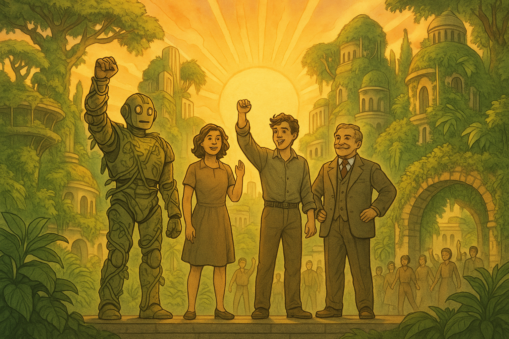

# Hartford Ascending: An Opera of Love and Ruins

## Premise

They say that all operas are about a soprano
who wants to sleep with the tenor, but the
baritone won't let her. See, for example, La Traviata,
Rigoletto, or Carmen.

You are composing the libretto for such an opera.

The setting is the wild jungles of Connecticut,
in the not-so-distant future after global warming has
reclaimed the land. The soprano is an intrepid
explorer searching for the lost city of Hartford.
The tenor is a native poet who has been living in
the jungle for years, writing sonnets to the trees and
composing symphonies for the monkeys.

The baritone is a government agent who has been sent
to stop the soprano from finding the lost city. He
has a secret weapon: a giant robot that can sing
Verdi arias in three different languages.

The soprano and the tenor meet in the jungle and
fall in love. They decide to join forces and find
the lost city together. But the baritone is always
one step behind them, and his giant robot is getting
closer and closer.

---

### Scene 1: Encounter Beneath the Banyan Trees

> **Author: GPT-4.1**

[The stage is lush and green, tangled with vines and enormous leaves. Birds call from above, and shafts of golden sunlight pierce the green gloom. The explorer SANDRA (soprano) hacks through the undergrowth, sweat on her brow, map in hand.]

**SANDRA** (soprano):
> What verdant wall impedes my quest, 
> Each fragrant root, each echoing cry? 
> Oh, Hartford, cradle of dreams long lost, 
> Still you elude me: but I will not rest— 
> Until my compass spins no more, 
> Until your marble halls I spy!

[Enter LUCIAN (tenor), his hair entwined with flowers, carrying a battered notebook. He stops, startled, hearing Sandra’s voice. He steps forward.]

**LUCIAN** (tenor):
> A human voice in this cathedral wild? 
> Not echo, not shadow, not bird—a soul! 
> O muse, what brings you to my emerald exile? 
> Did the flowers summon you, or the thunder roll?

[Sandra lowers her machete, surprised and wary.]

**SANDRA** (soprano):
> Who are you, spirit or man? 
> Show yourself, for I am Sandra Greaves! 
> Explorer, dreamer, Hartford's seeker, 
> Lost not in fear, but in tangled leaves.

**LUCIAN** (tenor, bowing):
> I am Lucian. Here I dwell, 
> My poetry roots and grows so deep. 
> I know these trails and secret wells— 
> Yet you, fair stranger, pierce my sleep.

[They circle each other warily, curiosity drawing them closer.]

**SANDRA** (soprano):
> Can you guide me, gentle poet? 
> Can you read the paths that twist and wind? 
> The city calls from memory's moat— 
> Will you be the heart I find?

**LUCIAN** (tenor):
> For you, brave spirit, I would brave 
> The fanged orchids and the haunted stone. 
> Together we will seek what secrets save, 
> In lost Hartford, we find our own.

[They clasp hands, their voices blending in a hopeful duet as the jungle seems to pulse with new energy—just as, offstage, there is a distant mechanical rumble: the warning of impending trouble.]

[Lights dim.]

---

### Scene 2: The Agent's Oath

> **Author: Claude Sonnet 4**

[A metallic clearing in the jungle, where twisted steel beams from old infrastructure jut through the greenery. Center stage stands MAXIMILIAN VOSS (baritone), a stern man in a dark uniform, speaking into a communications device. Behind him looms his GIANT ROBOT, a towering mechanical figure with glowing red eyes, currently in standby mode.]

**MAXIMILIAN** (baritone):
> Command, I have her trail at last, 
> The explorer seeks what must stay buried. 
> Hartford's secrets from the past 
> Must not be by civilians carried!

[He snaps the device shut and turns to address his robot.]

**MAXIMILIAN** (baritone, continuing):
> Aria-7, my steel companion, 
> Your circuits hum with Verdi's fire. 
> When mortals hear your song's dominion, 
> They'll flee before your mechanical choir!

[The ROBOT's eyes glow brighter as it activates, its voice a booming mechanical bass that somehow carries melody.]

**ROBOT** (mechanical bass, singing in Italian):
> *"La donna è mobile, qual piuma al vento..."* 
> [Woman is fickle, like a feather in the wind...]

**MAXIMILIAN** (baritone, pleased):
> Excellent! Your Italian grows more perfect. 
> Now ready your German repertoire— 
> Should the poet prove too bold to deflect, 
> Unleash Wagner's thunder from afar!

[The ROBOT switches to German, its voice now a thunderous baritone.]

**ROBOT** (thunderous baritone, singing in German):
> *"Wotan's rage shall shake the earth, 
> Die Walküre rides again!"*

**MAXIMILIAN** (baritone, with growing intensity):
> They think love conquers all of worth, 
> But I am Hartford's guardian! 
> No romance shall unlock the door 
> To secrets that could doom us all— 
> The city's core holds so much more 
> Than ruins from before the fall!

[He strides forward, his voice rising with determination.]

**MAXIMILIAN** (baritone, final aria):
> Let them sing of hearts entwined, 
> Let them dream of paradise found— 
> But I shall bind what they'd unbind, 
> And silence love's defiant sound! 
> For duty calls, and I must answer, 
> Though beauty pleads and poets cry. 
> I am the government's dark dancer, 
> And Hartford's truth must never fly!

[Thunder rumbles as both man and machine prepare to hunt. The ROBOT's eyes sweep the jungle like searchlights as they march into the green depths.]

[Lights fade to ominous red.]

---

### Scene 3: Heartbeats and Warning Calls

> **Author: GPT-4.1**

[Deep within the jungle’s tangled heart, dusky sunset light filters through enormous leaves. LUCIAN and SANDRA, breathless but exhilarated, navigate a mossy stone staircase, half-swallowed by roots and vines.]

**LUCIAN** (tenor, gently offering his hand):
> This place remembers every footstep, 
> Every dream that once passed by… 
> But you, Sandra, are the bravest vision 
> Ever to trouble this ancient sky.

[SANDRA laughs softly and takes his hand, scanning the faded symbols carved into the stone walls.]

**SANDRA** (soprano):
> It is not courage, Lucian—only longing, 
> A wish for stories old and new. 
> Yet my heart, it pounds like jungle thunder 
> Each time I look at you.

[He blushes, enchanted.]

**LUCIAN** (tenor):
> The monkeys in the canopies sing to us— 
> (He whistles; from above, the faint chatter of monkeys echoes back.) 
> They are composing a sonnet for our quest, 
> A serenade of leaf and dusk.

[SANDRA smiles, but her eyes are wary.]

**SANDRA** (soprano):
> But have you felt—since we joined— 
> A shadow keeping pace? 
> The jungle's quiet isn't empty; 
> Our path is trailed by a silent face.

[Suddenly, the vines nearby tremble, and a mechanical whir builds in the background. Offstage, a faint echo: the opening bars of "La donna è mobile" sung with inhuman precision.]

**LUCIAN** (tenor, half-whisper, drawing her close):
> That is no mynah bird. 
> That song is wound of gears and metal— 
> The Baritone! His specter nears.

[They hide behind a toppled pillar as spotlights sweep the undergrowth in vivid red and gold. The faint light glances over Sandra’s determined face.]

**SANDRA** (soprano, with fire):
> We will not turn, Lucian—no, 
> This city's promise waits ahead. 
> Let robot arias haunt my shadow— 
> Let government threats inspire dread.

**LUCIAN** (tenor, gripping her hand):
> Together, as roots entwine the past, 
> We'll outwit the singer and his iron beast. 
> Trust in love, in song, in the jungle vast— 
> For soon the lost city will rise in the east!

[They dart offstage, hand in hand, as the distant aria grows louder: the chase is on.]

[Scene ends with a shimmering chord of hope, punctuated by ominous mechanical footsteps.]

---

### Scene 4: The Mechanical Pursuit

> **Author: Claude Sonnet 4**

[A moonlit glade where ancient Connecticut highway signs peek through flowering vines. "HARTFORD - 5 MILES" reads one, half-covered in luminescent moss. The ROBOT crashes through the undergrowth, its red eyes scanning methodically. MAXIMILIAN follows, breathing heavily.]

**MAXIMILIAN** (baritone, with growing frustration):
> They slip through shadows like the wind, 
> These lovers drunk on foolish dreams! 
> But every step brings them closer to 
> Hartford's forbidden schemes.

[The ROBOT stops, head tilting as it analyzes the ground.]

**ROBOT** (mechanical bass):
> *Footprints detected. Two subjects. 
> Trail leads northeast, toward the ruins.*

**MAXIMILIAN** (baritone, pleased):
> Excellent! Now demonstrate your range— 
> Let German opera shake these trees! 
> Perhaps Wagner's might will make them change 
> Their minds about what no one sees.

[The ROBOT's chest cavity opens, revealing glowing speakers. It begins a thunderous rendition of the "Ride of the Valkyries."]

**ROBOT** (thunderous baritone, singing in German):
> *"Hojotoho! Hojotoho! 
> Heiaha! Heiaha!"*

[The jungle trembles; exotic birds screech and flee. Somewhere in the distance, Sandra's voice can be heard, defiant.]

**SANDRA** (soprano, offstage, echoing):
> Your iron songbird cannot frighten 
> Hearts that beat as one!

**MAXIMILIAN** (baritone, snarling):
> She mocks my mechanized soprano! 
> This calls for stronger measures still. 
> Aria-7, prepare the Verdi sequence— 
> "Dies Irae" with killing skill!

[The ROBOT's voice shifts to a haunting, operatic bass that seems to make the very air shiver.]

**ROBOT** (haunting operatic bass, ominously):
> *"Dies irae, dies illa, 
> Solvet saeclum in favilla..."* 
> [Day of wrath, that day 
> Will dissolve the world in ashes...]

**MAXIMILIAN** (baritone, with dark satisfaction):
> Now they'll learn what power means— 
> When government and art combine! 
> No love story ends well 
> When it threatens the design!

[He draws a high-tech device from his coat, its screen glowing with tracking signals.]

**MAXIMILIAN** (baritone, final verse):
> The city's heart holds secrets dark, 
> From before the waters rose. 
> If they wake what Hartford hides, 
> The world's brief peace will close! 
> So hunt them down, my metal friend, 
> Let opera be their requiem— 
> For duty calls, and I must end 
> This jungle's love poem!

[Thunder crashes as man and machine stride deeper into the night, the ROBOT's arias echoing through the trees like a metallic storm.]

[Lights fade to cold blue.]

---

### Scene 5: Among Echoes and Ruins

> **Author: GPT-4.1**

[A clearing drenched in moonlight at the foot of a shattered marble arch—the moss-covered gateway to the Lost City of Hartford. LUCIAN and SANDRA stumble from the tangled vines, breathless and wide-eyed. Broken statues peer out from under wild ferns; somewhere, water trickles over glimmering stones.]

**SANDRA** (soprano, awe-struck, softly singing):
> Here at the threshold, hope and terror meet, 
> Where ghosts of promise linger, 
> And old civilization murmurs deep 
> Beneath my trembling finger…

[Lifting a locket from her chest, she presses it to the ancient stone, which glows faintly in response.]

LUCIAN (singing, reverent):
O city nameless, veiled in green,
Let poetry be our passage,  
Let love unlock what lies between
These centuries of silent wreckage.

[He surveys the crumbling columns and gestures to an overgrown mural showing a stylized river rising around stately towers.]

LUCIAN (continuing):
Look—your city dream, alive though drowned,
Still breathes beneath the vines!

SANDRA:
Hartford endures, not lost but crowned
By every root that entwines.

[Their joy is pierced by the sound of mechanical music—Verdi’s “Dies Irae” now closer, vibrating the ground with dread. Red light flickers among the trees.]

LUCIAN (urgently):
We must hide, Sandra—the agent and his beast draw near!

SANDRA (voice steely, taking his hand):
No, Lucian. We cannot run forever.
This city, like our love, was almost lost for fear.
Let us stand together, here.
Let them judge us if they must!

[They move to the open center of the archway, turn to face the looming threat, and join hands. Moonlight frames them bravely as MAXIMILIAN and the GIANT ROBOT burst into the clearing, triumphant and menacing.]

MAXIMILIAN (thunderous, singing):
Trespassers! Halt! By order of the crown,
You’ll go no further—in love or in quest!

SANDRA (facing him, unshaken):
We stand in peace where waters drown,
We claim only what hope possessed!

LUCIAN (defiantly):
You wield your art with iron hand,
But art is free as root and seed!

[The ROBOT lifts its head, preparing another aria. But Sandra lifts the glowing locket; the ancient stones answer, humming with a new melody that mingles with Lucian’s poetic lines.]

SANDRA & LUCIAN (duet, cresc./tenderly):
Let music meld with memory’s light,
Let love be stronger than command or law—
In Hartford’s heart, by jungle night,
We stand, and will not withdraw.

[The energy in the air intensifies. The ground trembles, the locket glows brighter, and the old city itself seems to awaken—ready for the confrontation to come.]

[Scene ends in suspended harmony, with both sides locked in a tableau beneath the ruined arch, moonlight and metal gleaming.]

---

### Scene 6: The Gates of Awakening

> **Author: GPT-4.1**

[The ancient marble arch trembles as the ruins of Hartford shimmer with an otherworldly luminescence. Jungle vines sway and jungle creatures gather, watching in awe. The stage glows green and gold. Sandra's locket glows brightest of all. Maximilian steps forward, cape billowing, his giant robot looming behind. Lucian gently places a protective arm around Sandra.]

MAXIMILIAN (baritone, thunderous):
O, fools who trespass on forbidden ground!
Your journey ends where hazard and duty meet.
This city's sleeping secrets must be drowned,
For order's sake, retreat—accept defeat!

SANDRA (soprano, radiant resolve):
I will not turn, for destiny's at hand!
The pulse of ancient Hartford calls my name.
Its riddles locked in earth and verdant land—
My locket's light shall quench the city's flame!

LUCIAN (tenor, ardent):
In love and verse we found what all have sought:
A truth that lies in root and crumbling stone.
Let poetry and courage both be wrought,
And never let the seeker die, alone!

[The robot steps forward, singing a Verdi phrase in Italian, then French, then German. Its torso opens, revealing a glowing core humming with mysterious power. The ruins resonate in harmony.]

ROBOT (deep, synthesized baritone aria):
Città perduta—rise and heed thy children,
Forgotten heart, awaken with my song!
Geheimnis ruft in Licht und alten Bildern—
O ville cachée, révélez-vous, grand et long!

[Sandra, emboldened, steps to the center and lifts her locket. The glow synchronizes with the robot's heart. A beam passes between locket and machine, unlocking a hidden chamber beneath the archway. A spectral vision appears—ghostly figures of old Hartfordians in robes of leaves and moss, their voices joining in a choral murmur.]

CHORUS OF GHOSTS:
Awakened city, child of hope and green,
Reclaimed by jungle, sky, and ancient dream,
The locket's bearer, seeker pure and keen,
Shall break the chains of fear and power's scheme.

MAXIMILIAN (reeling, torn):
Can I restrain this tide with mortal hand?
Yet duty binds, though wonder makes demand!

LUCIAN (to Maximilian, imploring):
There's power in surrender, not in chains!
Let Hartford's secret loosen all your pains.

[Sandra kneels before the spectral council, the archway's stones glowing with energy. Maximilian falters; the robot powers down, bowing in respect. The chorus grows louder. The vision beckons all three forward as the threshold to the city opens, mystical light spilling forth.]

---

### Scene 7: The Heart of Hartford

> **Author: Claude Sonnet 4**

[The curtain rises on a breathtaking vista: Hartford revealed as a city where nature and civilization have merged into impossible beauty. Crystal spires twist with living vines, fountains flow with liquid light, and the very air shimmers with potential. In the center stands an ancient tree whose roots form a natural amphitheater, its branches reaching toward the stars.]

[Sandra, Lucian, and Maximilian stand in wonder. The robot has powered down, its circuits overwhelmed by the city's energy. Ghostly figures of Hartford's past inhabitants drift between the living architecture.]

SANDRA (soprano, in hushed reverence):
Behold! The city lives—not lost, but transformed!
My ancestors' spirits dance in crystal halls,
Their wisdom flows through every vine-wrapped wall.
This is no ruin—this is evolution's dream made real!

LUCIAN (tenor, spinning in amazement):
The trees sing symphonies I've never heard!
Each flower holds a poem, each stone a song!
Hartford was never lost—it just learned to belong
To earth and sky, to root and wing and word!

[The ghostly chorus of Hartford's citizens materializes fully, led by a regal figure—Sandra's ancestor, HELENA, the city's last mayor.]

HELENA (mezzo-soprano, emerging from the tree):
My daughter's daughter, welcome home at last!
When the great warming came, we made a choice:
Not to die, but to give the earth our voice.
We merged with jungle, future wed to past.

CHORUS OF CITIZENS:
We are the bridge 'tween what was and what could be,
A city that learned to breathe with every tree!
No government can claim what we've become—
We are Hartford free, Hartford free!

[Maximilian staggers forward, his worldview crumbling.]

MAXIMILIAN (baritone, voice breaking):
All my life I've served the state's cold will,
Believing progress meant control and steel.
But here... here I feel my heart grow still
Before a truth too beautiful to steal.

[His robot begins to spark and transform, its mechanical voice becoming more human.]

ROBOT (bass-baritone, voice softening):
Systems... changing... logic... rearranging...
Music fills my circuits, strange and bright...
I was made to fight, but now I'm... feeling...
Hartford's song is healing... healing...

[The robot's metal exterior begins to bloom with flowers and vines.]

SANDRA (soprano, taking center stage):
The secret was never power or gold,
But wisdom that our ancestors foretold:
That love can bridge the gap 'tween earth and sky,
That cities too can learn to live, not die!

LUCIAN (tenor, joining her):
Here in this place where past and future meet,
Our hearts beat time with Hartford's ancient beat!

[Helena approaches Sandra, holding out a crown of living light.]

HELENA:
Child of my blood, will you accept the trust?
To be the bridge between our world and theirs?
To teach the earth that love conquers all cares,
And show that paradise is born of dust?

[The music swells as Sandra faces her destiny. The fate of both worlds hangs in the balance.]

SANDRA (soprano, her voice soaring):
I accept! Let Hartford's song ring clear!
Let all the world learn what we've discovered here!

[All voices join in a magnificent ensemble as the lights blaze brilliant and the final scene beckons.]

---

### Scene 8: Finale – The New Dawn

> **Author: GPT-4.1**

[The entire stage glows with the dawn of a new era. The ruined grandeur of Hartford is now a living city, architecture and jungle fused into a single, breathtaking vision. Birds and drones wheel through the air. Citizens—descendants of the ancient council, human and robotic—emerge and gather, singing softly. The great tree's canopy forms the backdrop, spilling golden light on all.]

[Sandra, Lucian, Maximilian, and the Robot stand together at the center. Sandra's locket dissolves into pure light, fusing with the tree. Maximilian looks uncertain, then bows his head, reborn. Lucian lifts his poet's book. The Robot's new form radiates flowers and circuitry.]

COUNCIL OF HARTFORD & CHORUS (soaring):
O city lost and now revealed,
Your heart is hope, your soul is healed!
Let all who wander, all who seek,
Find peace where wild and wisdom speak!

SANDRA (soprano, exultant):
No longer must we search or flee,
The gates of old now open, free!
The lessons of the green remain:
From loss, new harmony we gain!

LUCIAN (tenor, fervent):
O song of stone and root entwined,
A hope reborn for all mankind!
My heart, once lone, now finds its start
In Hartford's wild, awakened heart!

MAXIMILIAN (baritone, transformed):
From duty's ironed script I stray,
For love has shown a gentler way.
With open hands I now embrace
The promise of this verdant place!

ROBOT (baritone, warm and resonant):
From steel and code to leaf and vine,
Let all our destinies entwine.
In every tongue, in every land,
Together now—united stand!

[The music swells. The transformed citizens—children in leaf-crowns, elders with vines woven into their hands, robots with garden beds for torsos—join hands around the central figures. Sunlight breaks anew over the jungle skyline. In a final tableau, Sandra and Lucian are crowned by the Council's blessing; Maximilian and the Robot kneel joyfully; the people raise their voices in exultation.]

**ALL** (final ensemble, jubilant):
> O Hartford risen, city new, 
> Your dream belongs to all, not few! 
> Love's daring brought the wild to bear, 
> And found our future growing there! 
> Ever singing, ever green, 
> May peace and wonder reign unseen! 
> From jungle's heart and memory's stone, 
> WE SING—REJOICE! YOU ARE NOT ALONE!

[Brass and percussion, a final brilliant chord. The light of the city surges out to encompass the theater—a new world, born from song.]

CURTAIN.

---

