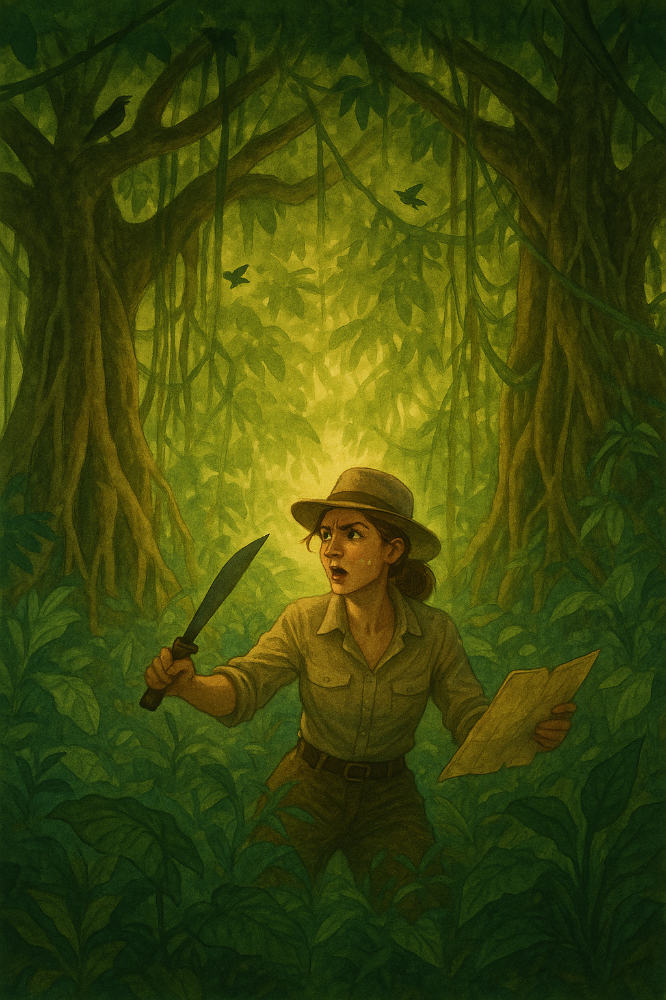

# Hartford Ascending: An Opera of Love and Ruins

## Premise

They say that all operas are about a soprano
who wants to sleep with the tenor, but the
baritone won't let her. See, for example, La Traviata,
Rigoletto, or Carmen.

You are composing the libretto for such an opera.

The setting is the wild jungles of Connecticut,
in the not-so-distant future after global warming has
reclaimed the land. The soprano is an intrepid
explorer searching for the lost city of Hartford.
The tenor is a native poet who has been living in
the jungle for years, writing sonnets to the trees and
composing symphonies for the monkeys.

The baritone is a government agent who has been sent
to stop the soprano from finding the lost city. He
has a secret weapon: a giant robot that can sing
Verdi arias in three different languages.

The soprano and the tenor meet in the jungle and
fall in love. They decide to join forces and find
the lost city together. But the baritone is always
one step behind them, and his giant robot is getting
closer and closer.

---

### Scene 1: Encounter Beneath the Banyan Trees

> **Author: GPT-4.1**

[The stage is lush and green, tangled with vines and enormous leaves. Birds call from above, and shafts of golden sunlight pierce the green gloom. The explorer SANDRA (soprano) hacks through the undergrowth, sweat on her brow, map in hand.]

SANDRA (singing):  
What verdant wall impedes my quest,  
Each fragrant root, each echoing cry?  
Oh, Hartford, cradle of dreams long lost,  
Still you elude me: but I will not rest—  
Until my compass spins no more,  
Until your marble halls I spy!

[Enter LUCIAN (tenor), his hair entwined with flowers, carrying a battered notebook. He stops, startled, hearing Sandra’s voice. He steps forward.]

LUCIAN (singing):  
A human voice in this cathedral wild?  
Not echo, not shadow, not bird—a soul!  
O muse, what brings you to my emerald exile?  
Did the flowers summon you, or the thunder roll?

[Sandra lowers her machete, surprised and wary.]

SANDRA:  
Who are you, spirit or man?  
Show yourself, for I am Sandra Greaves!  
Explorer, dreamer, Hartford's seeker,  
Lost not in fear, but in tangled leaves.

LUCIAN (bowing):  
I am Lucian. Here I dwell,  
My poetry roots and grows so deep.  
I know these trails and secret wells—  
Yet you, fair stranger, pierce my sleep.

[They circle each other warily, curiosity drawing them closer.]

SANDRA:  
Can you guide me, gentle poet?  
Can you read the paths that twist and wind?  
The city calls from memory’s moat—  
Will you be the heart I find?

LUCIAN:  
For you, brave spirit, I would brave  
The fanged orchids and the haunted stone.  
Together we will seek what secrets save,  
In lost Hartford, we find our own.

[They clasp hands, their voices blending in a hopeful duet as the jungle seems to pulse with new energy—just as, offstage, there is a distant mechanical rumble: the warning of impending trouble.]

[Lights dim.]

---

### Scene 2: The Agent's Oath

> **Author: Claude Sonnet 4**

[A metallic clearing in the jungle, where twisted steel beams from old infrastructure jut through the greenery. Center stage stands MAXIMILIAN VOSS (baritone), a stern man in a dark uniform, speaking into a communications device. Behind him looms his GIANT ROBOT, a towering mechanical figure with glowing red eyes, currently in standby mode.]

MAXIMILIAN (singing in commanding tones):
Command, I have her trail at last,
The explorer seeks what must stay buried.
Hartford's secrets from the past
Must not be by civilians carried!

[He snaps the device shut and turns to address his robot.]

MAXIMILIAN (continuing):
Aria-7, my steel companion,
Your circuits hum with Verdi's fire.
When mortals hear your song's dominion,
They'll flee before your mechanical choir!

[The ROBOT's eyes glow brighter as it activates, its voice a booming mechanical bass that somehow carries melody.]

ROBOT (singing in Italian):
*"La donna è mobile, qual piuma al vento..."*
[Woman is fickle, like a feather in the wind...]

MAXIMILIAN (pleased):
Excellent! Your Italian grows more perfect.
Now ready your German repertoire—
Should the poet prove too bold to deflect,
Unleash Wagner's thunder from afar!

[The ROBOT switches to German, its voice now a thunderous baritone.]

ROBOT (singing):
*"Wotan's rage shall shake the earth,
Die Walküre rides again!"*

MAXIMILIAN (with growing intensity):
They think love conquers all of worth,
But I am Hartford's guardian!
No romance shall unlock the door
To secrets that could doom us all—
The city's core holds so much more
Than ruins from before the fall!

[He strides forward, his voice rising with determination.]

MAXIMILIAN (final aria):
Let them sing of hearts entwined,
Let them dream of paradise found—
But I shall bind what they'd unbind,
And silence love's defiant sound!
For duty calls, and I must answer,
Though beauty pleads and poets cry.
I am the government's dark dancer,
And Hartford's truth must never fly!

[Thunder rumbles as both man and machine prepare to hunt. The ROBOT's eyes sweep the jungle like searchlights as they march into the green depths.]

[Lights fade to ominous red.]

---

### Scene 3: Heartbeats and Warning Calls

> **Author: GPT-4.1**

[Deep within the jungle’s tangled heart, dusky sunset light filters through enormous leaves. LUCIAN and SANDRA, breathless but exhilarated, navigate a mossy stone staircase, half-swallowed by roots and vines.]

LUCIAN (gently, offering his hand):  
This place remembers every footstep,  
Every dream that once passed by…  
But you, Sandra, are the bravest vision  
Ever to trouble this ancient sky.

[SANDRA laughs softly and takes his hand, scanning the faded symbols carved into the stone walls.]

SANDRA (singing):  
It is not courage, Lucian—only longing,  
A wish for stories old and new.  
Yet my heart, it pounds like jungle thunder  
Each time I look at you.

[He blushes, enchanted.]

LUCIAN:  
The monkeys in the canopies sing to us—  
(He whistles; from above, the faint chatter of monkeys echoes back.)  
They are composing a sonnet for our quest,  
A serenade of leaf and dusk.

[SANDRA smiles, but her eyes are wary.]

SANDRA:  
But have you felt—since we joined—  
A shadow keeping pace?  
The jungle’s quiet isn’t empty;  
Our path is trailed by a silent face.

[Suddenly, the vines nearby tremble, and a mechanical whir builds in the background. Offstage, a faint echo: the opening bars of "La donna è mobile" sung with inhuman precision.]

LUCIAN (half-whisper, drawing her close):  
That is no mynah bird.  
That song is wound of gears and metal—  
The Baritone! His specter nears.

[They hide behind a toppled pillar as spotlights sweep the undergrowth in vivid red and gold. The faint light glances over Sandra’s determined face.]

SANDRA (singing with fire):  
We will not turn, Lucian—no,  
This city’s promise waits ahead.  
Let robot arias haunt my shadow—  
Let government threats inspire dread.

LUCIAN (gripping her hand):  
Together, as roots entwine the past,  
We’ll outwit the singer and his iron beast.  
Trust in love, in song, in the jungle vast—  
For soon the lost city will rise in the east!

[They dart offstage, hand in hand, as the distant aria grows louder: the chase is on.]

[Scene ends with a shimmering chord of hope, punctuated by ominous mechanical footsteps.]

---

### Scene 4: The Mechanical Pursuit

> **Author: Claude Sonnet 4**

[A moonlit glade where ancient Connecticut highway signs peek through flowering vines. "HARTFORD - 5 MILES" reads one, half-covered in luminescent moss. The ROBOT crashes through the undergrowth, its red eyes scanning methodically. MAXIMILIAN follows, breathing heavily.]

MAXIMILIAN (singing with growing frustration):
They slip through shadows like the wind,
These lovers drunk on foolish dreams!
But every step brings them closer to
Hartford's forbidden schemes.

[The ROBOT stops, head tilting as it analyzes the ground.]

ROBOT (in mechanical English):
*Footprints detected. Two subjects.
Trail leads northeast, toward the ruins.*

MAXIMILIAN (pleased):
Excellent! Now demonstrate your range—
Let German opera shake these trees!
Perhaps Wagner's might will make them change
Their minds about what no one sees.

[The ROBOT's chest cavity opens, revealing glowing speakers. It begins a thunderous rendition of the "Ride of the Valkyries."]

ROBOT (singing in German):
*"Hojotoho! Hojotoho!
Heiaha! Heiaha!"*

[The jungle trembles; exotic birds screech and flee. Somewhere in the distance, Sandra's voice can be heard, defiant.]

SANDRA (offstage, echoing):
Your iron songbird cannot frighten
Hearts that beat as one!

MAXIMILIAN (snarling):
She mocks my mechanized soprano!
This calls for stronger measures still.
Aria-7, prepare the Verdi sequence—
"Dies Irae" with killing skill!

[The ROBOT's voice shifts to a haunting, operatic bass that seems to make the very air shiver.]

ROBOT (singing ominously):
*"Dies irae, dies illa,
Solvet saeclum in favilla..."*
[Day of wrath, that day
Will dissolve the world in ashes...]

MAXIMILIAN (with dark satisfaction):
Now they'll learn what power means—
When government and art combine!
No love story ends well
When it threatens the design!

[He draws a high-tech device from his coat, its screen glowing with tracking signals.]

MAXIMILIAN (final verse):
The city's heart holds secrets dark,
From before the waters rose.
If they wake what Hartford hides,
The world's brief peace will close!
So hunt them down, my metal friend,
Let opera be their requiem—
For duty calls, and I must end
This jungle's love poem!

[Thunder crashes as man and machine stride deeper into the night, the ROBOT's arias echoing through the trees like a metallic storm.]

[Lights fade to cold blue.]

---

### Scene 5: Among Echoes and Ruins

> **Author: GPT-4.1**

[A clearing drenched in moonlight at the foot of a shattered marble arch—the moss-covered gateway to the Lost City of Hartford. LUCIAN and SANDRA stumble from the tangled vines, breathless and wide-eyed. Broken statues peer out from under wild ferns; somewhere, water trickles over glimmering stones.]

SANDRA (awe-struck, softly singing):
Here at the threshold, hope and terror meet,
Where ghosts of promise linger,
And old civilization murmurs deep
Beneath my trembling finger…

[Lifting a locket from her chest, she presses it to the ancient stone, which glows faintly in response.]

LUCIAN (singing, reverent):
O city nameless, veiled in green,
Let poetry be our passage,  
Let love unlock what lies between
These centuries of silent wreckage.

[He surveys the crumbling columns and gestures to an overgrown mural showing a stylized river rising around stately towers.]

LUCIAN (continuing):
Look—your city dream, alive though drowned,
Still breathes beneath the vines!

SANDRA:
Hartford endures, not lost but crowned
By every root that entwines.

[Their joy is pierced by the sound of mechanical music—Verdi’s “Dies Irae” now closer, vibrating the ground with dread. Red light flickers among the trees.]

LUCIAN (urgently):
We must hide, Sandra—the agent and his beast draw near!

SANDRA (voice steely, taking his hand):
No, Lucian. We cannot run forever.
This city, like our love, was almost lost for fear.
Let us stand together, here.
Let them judge us if they must!

[They move to the open center of the archway, turn to face the looming threat, and join hands. Moonlight frames them bravely as MAXIMILIAN and the GIANT ROBOT burst into the clearing, triumphant and menacing.]

MAXIMILIAN (thunderous, singing):
Trespassers! Halt! By order of the crown,
You’ll go no further—in love or in quest!

SANDRA (facing him, unshaken):
We stand in peace where waters drown,
We claim only what hope possessed!

LUCIAN (defiantly):
You wield your art with iron hand,
But art is free as root and seed!

[The ROBOT lifts its head, preparing another aria. But Sandra lifts the glowing locket; the ancient stones answer, humming with a new melody that mingles with Lucian’s poetic lines.]

SANDRA & LUCIAN (duet, cresc./tenderly):
Let music meld with memory’s light,
Let love be stronger than command or law—
In Hartford’s heart, by jungle night,
We stand, and will not withdraw.

[The energy in the air intensifies. The ground trembles, the locket glows brighter, and the old city itself seems to awaken—ready for the confrontation to come.]

[Scene ends in suspended harmony, with both sides locked in a tableau beneath the ruined arch, moonlight and metal gleaming.]

---

