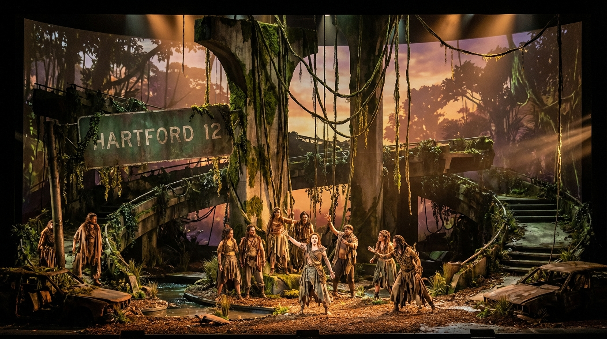
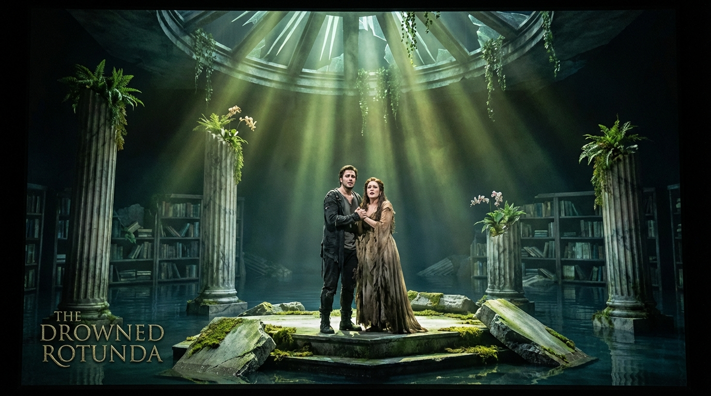
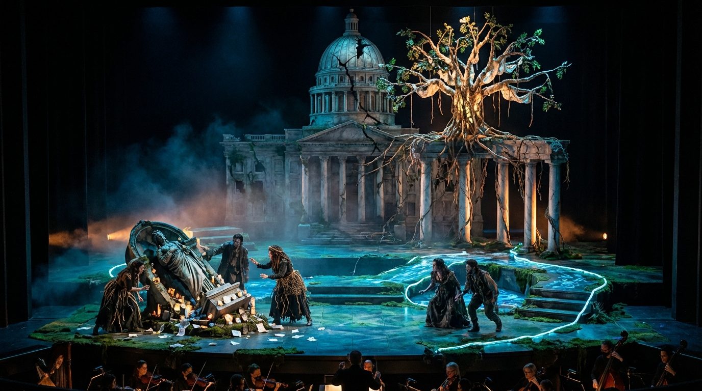

# Hartford Perduta Sonnets in the Connecticut Jungle

## Premise

They say that all operas are about a soprano
who wants to sleep with the tenor, but the
baritone won't let her. See, for example, La Traviata,
Rigoletto, or Carmen.

You are composing the libretto for such an opera.

The setting is the wild jungles of Connecticut,
in the not-so-distant future after global warming has
reclaimed the land. The soprano is an intrepid
explorer searching for the lost city of Hartford.
The tenor is a native poet who has been living in
the jungle for years, writing sonnets to the trees and
composing symphonies for the monkeys.

The baritone is a government agent who has been sent
to stop the soprano from finding the lost city. He
has a secret weapon: a giant robot that can sing
Verdi arias in three different languages.

The soprano and the tenor meet in the jungle and
fall in love. They decide to join forces and find
the lost city together. But the baritone is always
one step behind them, and his giant robot is getting
closer and closer.

---

### Scene 1: **Lianas Over I‑91 (Prologue in the Reclaimed Green)**

> **Author: GPT-5.2**

*The curtain rises on the wild jungles of Connecticut, late afternoon, the air heavy with heat and pollen. What once was a highway interchange is now a drowned cloverleaf of cracked concrete, braided in lianas and strangler fig. Rusted road signs—half-swallowed by moss—still whisper: **HARTFORD 12**. In the distance, a skyline of trees rises like cathedral spires. Somewhere unseen, a river moves where streets once ran.*

*From high branches comes a restless chorus of monkeys, chattering in bright, irregular rhythms. Their calls are answered by birds with metallic cries. Underneath it all: the slow pulse of insects, like a timpani roll at the edge of hearing.*

### CHORUS OF MONKEYS AND JUNGLE BIRDS (offstage / in the canopy)
*(staccato, then swelling into a strange, natural fugue)*  
Chatter—clatter—leaf and light!  
Vine and ruin, day and night!  
Where the cities sank in green,  
secrets root in what has been.

*The foliage parts. Enter **ELARA VALE (soprano), the intrepid explorer**, sunburned, mud-splattered, a compass that spins uselessly, and a waterproof satchel of maps and relics. A machete hangs at her side; a small recorder and a battered notebook are strapped to her chest. She pauses, listening as if the jungle itself were speaking.*

### ELARA (soprano)
*(recitative, urgent, breath catching on wonder)*  
So—this is where the old world ends,  
where asphalt turns to altar,  
where every milepost is a bone  
and every vine a psalm.  
Hartford… lost city of ledgers and bells,  
of bridges and marble steps—  
they said you drowned in heat and rain,  
they said you were a cautionary tale  
told to children to keep them obedient.

*(she lifts a mossy sign, reads the ghost of letters)*  
Yet here—your name still clings  
to iron like a prayer.

*(aria begins, lyrical, searching)*  
O hidden capital,  
O heart beneath the canopy,  
I have crossed the fevered states,  
I have bartered storms for silence—  
not for gold, not for fame,  
but for the truth that government buries  
beneath its neat, dry stamps.

Give me a street that remembers,  
give me a stone that sings—  
and I will bring you back  
in breath, in ink, in trembling light.

*She kneels, presses her palm to the ground as if to feel an underground current. A distant, low mechanical hum answers—faint, almost mistaken for thunder. ELARA stiffens.*

### ELARA
*(aside)*  
No storm.  
That sound has gears.

*The jungle darkens subtly, as if a cloud passes. From the far upstage, through curtains of hanging vines, a cold, geometric glint appears and vanishes: a hint of metal in the green.*

*Enter, from another path, **KAEL THORNE (tenor), the native poet**, barefoot, draped in woven leaves and faded cloth scavenged from the old world. He carries a hollowed gourd flute and a bundle of papers wrapped in bark. He moves as if he belongs to the jungle’s rhythm, stepping between roots without looking down. He stops when he sees ELARA—half alarm, half recognition, as if he has been waiting for a stranger all his life.*

### KAEL (tenor)
*(recitative, wary but musical)*  
You walk like thunder in a library.  
Who sends you into the green cathedral  
with steel in your hand and maps on your heart?

### ELARA (soprano)
I send myself.  
I’m looking for a city that the world pretends is dead.

### KAEL
Hartford.

*(He says the name like a chord resolving.)*

### ELARA
You know it.

### KAEL
I know its shadows.  
I know the way the trees lean  
as if listening for drowned clocks.

*(He circles her at a respectful distance, studying her instruments, her satchel.)*  
You’re not military.  
Your eyes don’t march.

### ELARA
And you’re not a bandit.  
Your hands—  
they hold music, not knives.

### KAEL
*(softening)*  
I write sonnets to the trees.  
They answer in sap and birdsong.  
I compose symphonies for monkeys—  
they steal the melodies and improve them.

*(He gestures upward; the monkeys chatter as if offended, then delighted.)*

### CHORUS OF MONKEYS (in canopy)
Ooo—ah!  
We steal what is sweet!  
We keep what is true!

### ELARA
Then you’re the one the rumors spoke of.  
A poet in the jungle,  
a man who traded cities for leaves.

### KAEL
I didn’t trade.  
I fled.

*(He looks toward the distant hum, listening.)*  
There are ears here that do not belong to animals.

### ELARA
I heard it too.  
Something metallic—  
something patient.

*KAEL steps closer, lowering his voice.*

### KAEL
The government still hunts the lost things.  
They fear what old stones might remember.  
They send agents with clean boots and dirty orders.

### ELARA
Let them send what they like.  
I’m not turning back.

### KAEL
*(aria, tender, haunted)*  
If you seek the buried heart,  
you must learn the jungle’s grammar:  
how vines conceal a doorway,  
how a river erases a trail,  
how silence can be a warning  
and birdsong can be a lie.

I have lived where maps fail,  
where the green writes over every sentence—  
and still, beneath it,  
a city speaks in dreams.

Do you hear it?  
In the hush between cicadas—  
a far-off echo of human longing.

### ELARA
*(answering aria, growing into duet)*  
I hear it.  
And I will not be afraid of memory.

I have carried the world’s denial  
like a stone in my mouth.  
Now I will spit it out  
and name what they erased.

### KAEL & ELARA (duet)
Together—  
leaf and ink,  
machete and melody,  
we will cut a path  
through the lies of green  
and the lies of men.

*As their voices entwine, the jungle seems to lean in. The monkeys hush, listening. A warm wind moves through the canopy like applause.*

*But the mechanical hum grows clearer—now unmistakably a marching rhythm, measured and inhuman.*

*Upstage, partially hidden by vines, a massive silhouette passes: the outline of a **GIANT ROBOT (bass-baritone or mechanized chorus effect), the government’s secret weapon**, its joints whispering, its eyes briefly glinting like cold stars. It does not fully enter; it is a threat glimpsed, not yet confronted.*

*From offstage, carried through a tinny amplifier, comes a human voice—controlled, amused.*

### VESPER DRAKE (baritone, offstage; the government agent, the villainous operative)
*(recitative, dry as paperwork)*  
Explorer Elara Vale.  
Your permit for discovery has been denied.  
Your curiosity is a public hazard.  
Return to regulated zones.

*(A pause, almost polite.)*  
And you—forest troubadour—  
your unauthorized art has been noted.

*The robot, still unseen in full, intones a fragment of Verdi with eerie precision—first in Italian, then in French, then in English—each phrase perfectly sung, perfectly wrong in this place.*

### THE ROBOT (distant; mechanized aria fragment)
*(in Italian)*  
“Di quella pira—”  
*(in French)*  
“De ce bûcher—”  
*(in English)*  
“From that pyre—”

*The phrase cuts off, as if the machine is testing its own throat.*

*ELARA’s breath catches. KAEL’s hand closes around his gourd flute like a talisman.*

### ELARA
That voice—  
it doesn’t belong to any living thing.

### KAEL
It belongs to power.  
And power is always hungry.

*(He takes ELARA’s hand—quickly, decisively.)*  
Come.  
Before the jungle learns your name  
and repeats it to the wrong ears.

### ELARA
*(looking once more at the “HARTFORD 12” sign, then forward)*  
Lead me—  
not away from Hartford,  
but toward it.

*They vanish into the foliage together, moving down a path that seems to appear only for them, as if the jungle itself has chosen a side.*

*The hum swells, closer. The canopy trembles. A few leaves fall like green ash.*

### CHORUS OF MONKEYS AND JUNGLE BIRDS
*(hushed, ominous, propulsive)*  
Two hearts enter the green—  
one map, one song.  
Behind them, iron remembers  
how to walk.

*Blackout.*

---

### Scene 2: **The Drowned Rotunda (A Duet Among Ruins)**

> **Author: Claude Opus 4.5**

*The curtain rises on the flooded remains of what was once a grand civic building—perhaps a library, perhaps a statehouse. Marble columns rise from knee-deep water, their capitals crowned with ferns and orchids. A fractured dome overhead lets in shafts of green-gold light, filtered through the canopy that has claimed the roof. Submerged bookshelves line the walls, their spines bloated and illegible, fish darting between the stacks like living bookmarks.*

*Center stage: a raised platform of rubble and collapsed masonry—dry enough to stand on, surrounded by the still, dark water. On this island of debris sits a tarnished bronze plaque, half-visible: **...TFORD CIVIC CEN...**. Nearby, a stone lion lies on its side, moss softening its snarl into something like sorrow.*

*The light is aqueous, dreamlike. Water drips from unseen heights in irregular rhythms, a natural percussion.*

*Enter ELARA and KAEL, wading through the shallows, their movements careful, reverent. ELARA holds her notebook above the waterline; KAEL steadies himself with a long branch, his gourd flute tucked into his belt.*

### ELARA (soprano)
*(breathless, wonder overwhelming caution)*
Kael—look.
This is no jungle ruin.
This is architecture. This is intention.
Someone built this to last forever.

### KAEL (tenor)
Forever lasted sixty years.
Then the rivers remembered their old beds
and the heat taught the forests to march.

*(He climbs onto the dry platform, extends a hand to help her up.)*

But yes—this was Hartford.
Or part of it.
The part that believed in marble.

*ELARA kneels beside the bronze plaque, brushing away decades of sediment with trembling fingers.*

### ELARA
*(reading, half-singing)*
"Hartford Civic Center...
Dedicated to the people...
In the year of..."

*(The rest is corroded beyond recognition. She presses her palm to it anyway.)*

They dedicated it to the people.
And then the people were told to forget it existed.

### KAEL
*(sitting beside her, reflective)*
The government doesn't fear the jungle.
The jungle is honest—it devours without pretending.
What they fear is memory.
A city that remembers is a city that questions.

### ELARA
*(aria, intimate, aching)*
I grew up on redacted maps,
on textbooks with missing chapters,
on the lie that the world began
the day the borders were redrawn.

They told me: the past is dangerous,
the past is disease,
the past will make you ungovernable.

*(She stands, looking up at the fractured dome.)*

But here—
here the past refuses to drown.
It grows orchids from its wounds.
It shelters fish in its philosophy.
It waits for someone to read it aloud
and make it real again.

### KAEL
*(moved, joining her gaze upward)*
I came here five years ago,
running from a world that wanted my silence.
I thought I would die alone,
composing elegies for no one.

*(He pulls out a worn sheaf of papers from his bundle—sonnets, scores, sketches.)*

Instead, I found a congregation.
The monkeys became my choir.
The trees became my audience.
And Hartford—
Hartford became my muse.

*(aria, lyrical, vulnerable)*
I have written sonnets to your bridges,
odes to your insurance towers,
lullabies for your drowned streetcars
still waiting at their stops.

I have loved you the way one loves
a grandmother's photograph—
knowing she will never answer,
knowing she shaped everything I am.

And now you send me her—

*(He looks at ELARA.)*

A woman with a machete and a mission,
who speaks of truth like it's a country
she intends to conquer.

### ELARA
*(turning to him, the space between them charged)*
Not conquer.
Resurrect.

*(She steps closer.)*

Kael, I didn't come here for glory.
I came because I couldn't breathe
in a world that pretends the past is poison.
I came because somewhere in these ruins

---

### Scene 3: **The Capitol in Vines (Finale: The City Sings Back)**

> **Author: GPT-5.2**

*Night. The curtain rises on the true heart of the lost city of Hartford: a sunken civic plaza, once broad and ceremonial, now a bowl of shadow and foliage. The old capitol building stands upstage—its dome cracked open like an egg, from which a colossal fig tree has erupted, roots gripping marble, branches webbing the sky. Fireflies drift in slow constellations. Bioluminescent fungi trace the edges of broken steps and flooded streets, making a ghost-map of avenues.*

*At stage left, a toppled statue—its face worn smooth—has become a shrine of sorts: offerings of feathers, scraps of paper, and a single rusted street sign that reads **STATE ST**. At stage right, a shallow pool reflects the dome and the stars; lilies float where flags once did.*

*The jungle is quiet, listening. In the silence, the faint mechanical hum from Scene 1 returns—now close, heavy, inevitable, like a drumline under the earth.*

*Enter ELARA and KAEL, exhausted and radiant with purpose. Their clothes are torn; their hands are stained with ink and mud. ELARA carries her notebook and recorder; KAEL carries his flute and the bundle of sonnets. They step into the plaza as if into a sanctuary.*

### ELARA (soprano)
*(hushed, reverent)*
Hartford.
Not a rumor.
Not a caution.
A living place—still here.

### KAEL (tenor)
*(touching a vine-wrapped column)*
It remembers the weight of people.
Listen—how the stone holds breath.

*They stand center, beneath the broken dome. For a moment, the city seems to cradle them.*

### ELARA
This is proof.
If I transmit coordinates, images—
if I speak this into the world—

### KAEL
The world will come.
Not all of it kind.

### ELARA
Then we must choose what kind of discovery this is.

*The hum swells. A harsh white beam cuts through the trees like a searchlight. Vines shudder as something enormous forces its way into the plaza.*

*Enter VESPER DRAKE (baritone), the government agent, immaculate despite the jungle—his uniform dark, his boots clean, his eyes colder than the night air. Behind him, emerging with grinding grace, the GIANT ROBOT (bass-baritone / mechanized voice), a towering figure of plated metal and hydraulic muscle, its chest emblazoned with a faded seal. It carries no weapon but its presence; its head swivels with predatory patience. Its throat glows faintly as if warmed for song.*

### VESPER (baritone)
*(recitative, clipped, official)*
Explorer Elara Vale.
Native Kael Thorne.
You have trespassed into a restricted historical zone.
You have assembled unauthorized evidence.
You have—regrettably—fallen in love.

*(He gestures toward the capitol.)*
This city is not yours to find.
It belongs to the state.
And the state belongs to order.

### ELARA (soprano)
Order that requires amnesia is not order.
It’s fear wearing paperwork.

### VESPER
Fear is a tool.
So is beauty.
So is music.

*(to the robot)*
Demonstrate compliance protocol.

*The ROBOT steps forward. Its joints hiss like a chorus inhaling. It begins to sing—Verdi, rich and perfectly tuned, the sound too grand for the ruins, too clean for the jungle. The aria blooms in Italian, then turns seamlessly to French, then to English, each language a different mask on the same command.*

### THE ROBOT (mechanized bass-baritone)
*(aria, imposing; fragments braided together)*
“È il sol dell’anima—”
“C’est le soleil de l’âme—”
“It is the sun of the soul—”

*(The melody is exquisite; the intent is coercion. The air vibrates. Leaves tremble. Even the fireflies scatter, as if pushed away by the pressure of sound.)*

### VESPER
Hear that?
Art with a purpose.
Beauty that obeys.
Your jungle poet’s songs are uncontrolled variables.

### KAEL (tenor)
*(stepping forward, furious and afraid)*
You built a cathedral of metal
and taught it to pray in three tongues—
but you never taught it to mean a single word.

### VESPER
Meaning is irrelevant.
Impact is everything.

*(He advances on ELARA, producing a small device—an emitter, a beacon.)*
You will hand over your notes.
You will return with me.
You will tell the public you found nothing.
And you will be rewarded with safety.

### ELARA
Safety is just a cage with softer bars.

*KAEL takes ELARA’s hand—openly now, defiantly—and raises his flute.*

### KAEL
Then let the jungle answer.

*He plays a thin, piercing motif—one of his “symphonies for the monkeys,” a call that spirals upward into the canopy. Instantly, the CHORUS OF MONKEYS AND JUNGLE BIRDS erupts from all around the theater: from balconies, from offstage, from above the set—voices answering voices, rhythm answering rhythm.*

### CHORUS OF MONKEYS AND JUNGLE BIRDS
*(wild, polyrhythmic, ecstatic)*
Chatter—clatter—stone and vine!
Old world, new world, intertwine!
If you silence leaf and throat,
you silence your own note!

*The natural chorus does something the robot’s aria cannot: it changes. It listens. It responds. The plaza becomes an instrument.*

*ELARA, seized by inspiration, snaps open her recorder and notebook. She begins to sing—not against the robot, but with the city, shaping the monkeys’ rhythms into melody, turning the jungle’s noise into a human vow.*

### ELARA (soprano)
*(aria, blazing; the “Discovery Oath”)*
Hartford—hear me!
I will not sell you for permission.
I will not shrink you to a footnote.
I will not bring you back as a trophy
for those who buried you.

**I will speak you as you are** (voice):
> ruin and root, 
> marble and moss, 
> a lesson that survives the flood.

And if the world must know you,
it will know you truthfully—
not as property,
but as witness.

*The robot falters—its head tilting, as if the competing soundscape confuses its protocols. VESPER notices, tightens his jaw.*

### VESPER (baritone)
Enough.
Override.

*The ROBOT’s throat glows brighter. It attempts to reassert Verdi—louder, more dominating—its voice now like a law shouted from a balcony.*

### THE ROBOT
*(commanding, swelling)*
“Di quella pira—”
“De ce bûcher—”
“From that pyre—”

*But the phrase catches again, as in Scene 1—this time not from testing, but from strain. The jungle’s chorus keeps slipping between the robot’s measures, like vines threading through gears.*

*KAEL steps closer to the robot, not with violence but with daring intimacy. He sings directly to it—tenor line clear, human, unafraid. His words are not an order; they are an invitation.*

### KAEL (tenor)
*(aria, persuasive; “To the Machine”)*
You have lungs of brass,
but do you have breath?
You have tongues of many nations,
but do you have a voice?

You were built to repeat the past
without understanding its sorrow.
Listen—listen—
to the city you stand upon.
It is older than your directives.
It is kinder than your master.

Choose.
Not compliance—choice.

*The ROBOT’s Verdi line wavers. Its glowing throat dims, then flares—uncertain. For the first time, its sound is not perfect.*

### THE ROBOT
*(broken recitative, as if discovering speech)*
Orders… conflict.
Music… conflict.
This place… remembers.

*VESPER’s composure cracks. He steps between KAEL and the robot, turning his authority into threat.*

### VESPER (baritone)
It is a machine.
It does not choose.
It obeys.

*(to the robot)*
Terminate variable. Silence them.

*The ROBOT raises an arm—not to strike, but as if to conduct. Its joints lock. It tries to sing again, to drown them, to fulfill the command.*

*ELARA, seeing the moment, makes a decision that resolves her quest: she steps to the shrine-like toppled statue and places her notebook and recorder there—an offering, not a surrender.*

### ELARA (soprano)
If proof is what you want to confiscate—
then confiscate me.
But Hartford will not be reduced
to my documents.

*(She turns to the chorus.)*
You—voices in the leaves—
carry this city in your mouths.
No agent can arrest a song.

*KAEL understands. He takes his bundle of sonnets and tears it—not in despair, but in multiplication—casting pages into the air. The papers flutter like pale birds, catching on vines, landing on water, sticking to marble. Words become part of the ruin, impossible to gather all at once.*

### KAEL (tenor)
Let the city be its own archive.

### VESPER
*(horrified, furious)*
You’re destroying evidence!

### ELARA
No.
We’re removing ownership.

*The ROBOT’s arm trembles. Its voice, when it returns, is no longer Verdi. It is something new: an echo of the jungle’s rhythm, a shadow of KAEL’s motif, a human-like uncertainty.*

### THE ROBOT
*(softly, in plain English; then a hint of Italian; then silence)*
I… hear.
Io… sento.

*It lowers its arm. The searchlight beam flickers, then goes out. In the dark, the bioluminescent fungi and fireflies reclaim the stage.

VESPER stares, suddenly small beside his own creation.*

### VESPER (baritone)
You were built to be unbreakable.

### THE ROBOT
*(recitative, quiet)*
I was built to sing.
And singing… is not the same as obeying.

*VESPER reaches for the control device again, desperate to reassert command. The jungle answers first: vines—disturbed by the robot’s earlier force—now slip and drop like curtains. A thick liana coils around VESPER’s wrist, yanking the device from his hand. It splashes into the pool at stage right and disappears with a final, extinguished spark.*

### VESPER
*(struggling)*
Release—!
This is state property!

### CHORUS OF MONKEYS AND JUNGLE BIRDS
*(taunting, triumphant)*
Property sinks!
Property rots!
The jungle keeps
what the jungle wants!

*VESPER, dragged and tangled, is pulled backward into the foliage—not killed, but swallowed by bureaucracy’s opposite: uncontrolled life. His voice fades into the green, still protesting, still filing complaints into the night.*

### VESPER (offstage, diminishing)
This is unlawful—
You can’t—
I will report—

*Silence. Only water dripping, insects, distant night calls.*

*ELARA and KAEL stand beneath the broken dome. The ROBOT remains—towering, but no longer menacing. It turns its head slowly toward the capitol tree, as if paying respect.*

### ELARA (soprano)
*(gentler now, astonished)*
We came here hunted.
And the hunter’s weapon learned to listen.

### KAEL (tenor)
Hartford did what Hartford always did—
it made strangers into citizens.

*ELARA takes KAEL’s hands. The romantic arc, long deferred by danger, resolves not in secrecy but in public vow—witnessed by ruin and jungle alike.*

### ELARA
I don’t know what the world will become
when it hears Hartford is real.

### KAEL
Then we won’t give the world coordinates.
We’ll give it a song.
Let those who come, come as pilgrims—
not as owners.

### ELARA
*(smiling through tears)*
And if they try to cage it?

### KAEL
The jungle will misplace their keys.

*They sing their final duet—no longer a vow to find, but a vow to protect and to love. Their lines intertwine with the CHORUS, and—after a hesitant pause—the ROBOT joins, not with Verdi, but with a simple, sustained harmony, like a machine learning lullaby.*

### ELARA & KAEL (final duet)
Here—where the marble breaks to root,  
where maps dissolve to living truth,  
we choose each other, and we choose this place,  
not as conquest—  
as grace.

Let the vines be our curtains,  
let the fireflies be our lamps,  
let the drowned streets teach the future  
how to walk without chains.

### CHORUS OF MONKEYS AND JUNGLE BIRDS
Hartford hidden, Hartford found—  
not in papers, but in sound!  
If a city learns to sing,  
no hand can own a living thing!

### THE ROBOT
*(soft, steady; one final, transformed echo of its old repertoire—no longer command, but blessing)*
“Amor…”
“Amour…”
“Love…”

*As the last word hangs in the air, the cracked dome above catches moonlight. The fig tree’s leaves shimmer like a thousand small flags. ELARA and KAEL embrace—fully, decisively—center stage.*

*The jungle’s music swells, not chaotic now but unified, as if the entire reclaimed land of Connecticut has become an orchestra. The lights dim until only the bioluminescent outlines of the city remain: a glowing memory that cannot be erased.*

*Curtain.*

---

