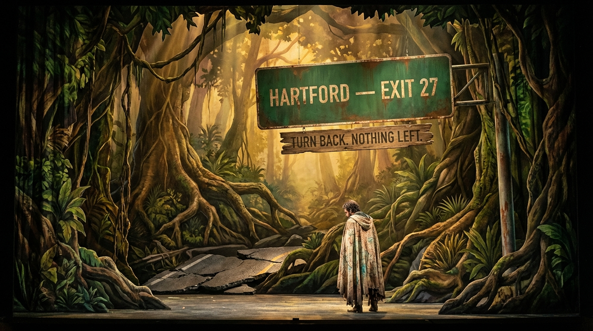
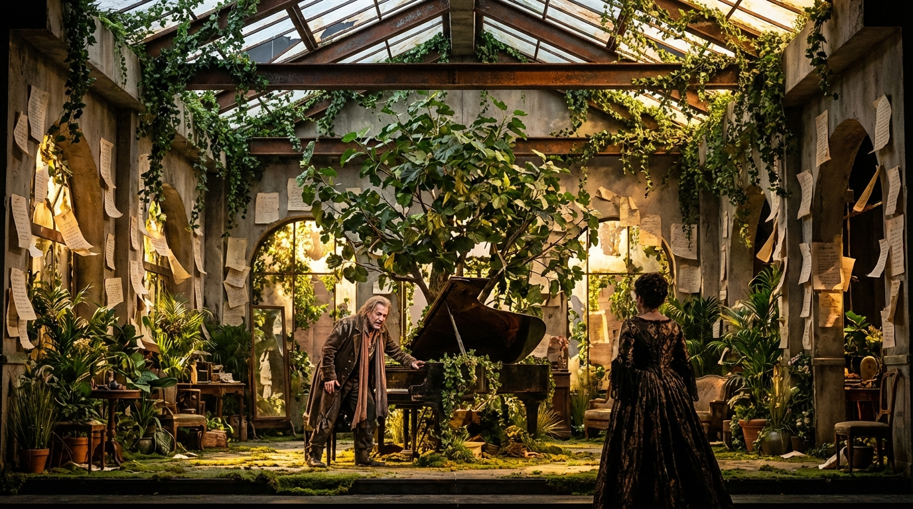
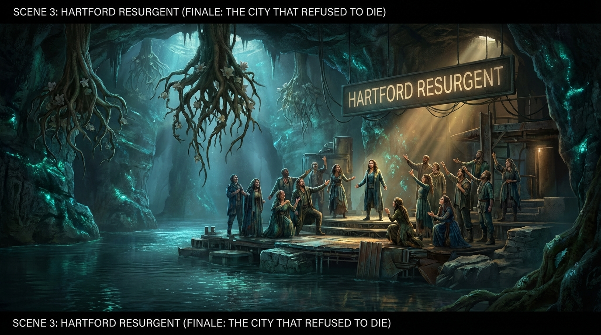

# The Vines of Reckoning: A Connecticut Jungle Opera

## Premise

They say that all operas are about a soprano
who wants to sleep with the tenor, but the
baritone won't let her. See, for example, La Traviata,
Rigoletto, or Carmen.

You are composing the libretto for such an opera.

The setting is the wild jungles of Connecticut,
in the not-so-distant future after global warming has
reclaimed the land. The soprano is an intrepid
explorer searching for the lost city of Hartford.
The tenor is a native poet who has been living in
the jungle for years, writing sonnets to the trees and
composing symphonies for the monkeys.

The baritone is a government agent who has been sent
to stop the soprano from finding the lost city. He
has a secret weapon: a giant robot that can sing
Verdi arias in three different languages.

The soprano and the tenor meet in the jungle and
fall in love. They decide to join forces and find
the lost city together. But the baritone is always
one step behind them, and his giant robot is getting
closer and closer.

---

### Scene 1: The Cartographer's Descent

> **Author: GPT-5.2**

*The curtain rises on a wall of green--impenetrable, primordial. What was once the Merritt Parkway is now a canyon of strangler figs and ceiba trees, their roots cracking through asphalt like slow-motion lightning. Rusted guardrails arc upward, seized by kudzu, forming natural archways. A faded green highway sign, barely legible, reads: HARTFORD -- EXIT 27. Below it, a newer sign--hand-painted on bark--reads: TURN BACK. NOTHING LEFT.*

*Morning light filters through the canopy in cathedral shafts. The air hums with cicadas, dripping moisture, and the distant shriek of macaws--species that should not exist this far north, but the climate has rewritten the rules.*

*From stage right, a rope drops from the canopy. Down it slides MIRABEL CROSS (soprano), the cartographer-explorer--wiry, sunburned, fierce. She wears a battered field vest covered in hand-stitched pockets, each containing instruments: a sextant, a barometer, a hand-cranked radio. On her back, a leather map case. Her boots hit the ground and she crouches, listening.*

**MIRABEL** (soprano):
> Twenty-seven days south from the New Haven perimeter. 
> Fourteen rivers forded. Three bridges collapsed beneath my weight. 
> The satellite maps show nothing here but green-- 
> the government's favorite color for erasure.

*(She pulls out a hand-drawn map, comparing it to the terrain.)*
> But the old maps don't lie. 
> The Connecticut River still bends here, 
> still carries the memory of a city in its current.

*(aria, determined, ascending)*
> I am the cartographer of forbidden places, 
> the woman who draws what power denies. 
> Every blank space on every sanctioned map 
> is a confession-- 
> a government admitting what it fears. 
> Hartford, I have followed your ghost 
> through swamp and canopy, 
> through checkpoints and lies, 
> through nights when the only light 
> was the phosphor of my own stubborn belief. 
> They erased you from the records. 
> I will draw you back into existence.

*She kneels, pressing her palm to the cracked asphalt. She closes her eyes. The jungle noise dims--and beneath it, almost imagined, comes a low pulse: the heartbeat of buried infrastructure, of water still flowing through pipes no one maintains.*

*From the canopy above, a shower of crumpled paper falls--not leaves, but pages. Handwritten sonnets on bark-paper, waterlogged and beautiful. MIRABEL catches one, reads it with growing astonishment.*

*A figure drops silently from a branch above--SYLVAN OAKES (tenor), the jungle poet. He is barefoot, lean as a vine, dressed in layers of salvaged fabric dyed green and brown with plant pigments. His hair is long, braided with small feathers. He carries a bamboo writing case and a hand-carved wooden flute.*

**SYLVAN** (tenor):
> I write poetry to a living city. 
> The dead don't need sonnets. 
> But a city buried alive-- 
> that needs every word I can give it.

**SYLVAN** (tenor, aria, lyrical, earnest):
> Then you are here for poetry. 
> Because Hartford is a poem now-- 
> not a place you find on any grid, 
> but a rhythm you must learn to hear. 
> I have walked its drowned avenues 
> by moonlight, knee-deep in warm water, 
> and I have heard the buildings hum-- 
> not with electricity, but with remembrance. 
> The old Travelers Tower still stands, 
> leaning like an ancient singer 
> who refuses to leave the stage. 
> At dawn, the vines that grip its sides 
> vibrate in the wind like strings.

*(He plays a brief, haunting phrase on his flute--the "Hartford motif.")*

> That is Hartford's voice. 
> I didn't compose it. 
> I only learned to listen.

**MIRABEL & SYLVAN** (duet, tentative, then building):
> MIRABEL: I draw lines through chaos-- 
> SYLVAN: I hear music in the wreckage-- 
> BOTH: And somewhere in the green cathedral, a city waits for witnesses.

*Their voices blend for the first time. The jungle responds--birdsong shifting key, monkeys chattering in something almost like approval.*

*But the moment is shattered. From far off, a sound unlike anything natural: a deep, resonant, mechanized voice singing the opening of Verdi's "La donna e mobile"--in Italian, perfect, terrifying.*

**THE COLOSSUS** (offstage, mechanized bass):
> "La donna e mobile 
> qual piuma al vento..."

*The jungle goes silent. Even the cicadas stop.*

**COMMANDANT VOSS** (baritone, offstage, amplified):
> Attention, unauthorized personnel. 
> You are in violation of Federal Reclamation Statute 47-B. 
> The territory designated "Former Hartford Metropolitan Area" 
> is classified, sealed, and forbidden.

*They plunge into the undergrowth together, vanishing into the green.*

**CHORUS OF MONKEYS AND JUNGLE BIRDS**:
> Run, run, through root and river! 
> The iron throat is coming! 
> But the jungle has ten thousand doors 
> and the government has only one key!

*Blackout.*

---

### Scene 2: The Poet's Garden and the Iron Aria

> **Author: Claude Opus 4.5**

*The curtain rises on a hidden clearing deep in the jungle--SYLVAN's sanctuary. He has cultivated a garden in the ruins of a collapsed shopping mall, its skylights shattered and open to the canopy above. Vines have been trained into archways. Salvaged mirrors redirect sunlight into warm pools where orchids bloom in impossible profusion. Along the walls, hundreds of bark-paper sonnets are pinned, fluttering like moth wings in the humid breeze.*

*Center stage: a grand piano--half-consumed by a fig tree, its keys yellowed but still functional where the roots have not yet reached. The tree's trunk grows through the instrument's body, and when the wind moves through the leaves, the piano's strings murmur sympathetically, producing ghost chords.*

**MIRABEL** (soprano):
> This is impossible. 
> A garden in a shopping mall. 
> A piano married to a tree. 
> You've built a world inside the wreckage.

**SYLVAN** (tenor):
> Not built. Negotiated. 
> The jungle wanted to reclaim this space. 
> I wanted to keep it. We compromised. 
> The fig tree gets the bass notes. 
> I get the treble. 
> We share the middle register 
> and argue about tempo.

**SYLVAN** (tenor, aria, intimate, confessional):
> I was a poet in the old world too-- 
> but in the old world, poetry was decorative. 
> A thing you put on shelves 
> between the bookends of a comfortable life. 
> Here, poetry is structural. 
> It holds things up. 
> My sonnets are the scaffolding 
> that keeps Hartford from forgetting itself. 
> Every morning I wake and recite 
> the names of streets: 
> Asylum Avenue, Capitol Avenue, Farmington-- 
> because if I stop saying them, 
> the jungle will swallow the syllables 
> and the streets will truly die.

**MIRABEL & SYLVAN** (duet, tender, the love theme):
> MIRABEL: I have mapped coastlines and craters, 
> drawn borders through disputed lands, 
> but I never mapped the distance 
> between two reaching hands. 
> SYLVAN: I have written odes to rivers, 
> sonnets to the patient stone, 
> but I never found the stanza 
> that could make a heart feel known. 
> BOTH: Here in the green confusion, 
> where the compass spins and spins, 
> perhaps the truest map is drawn 
> where one breath ends 
> and another begins.

*They almost kiss. The piano tree plays a resolving chord--which is obliterated by a massive, ground-shaking footfall. The COLOSSUS has found them.*

*It enters upstage, crashing through the mall's remaining wall. Twelve feet tall, burnished bronze and steel, its chest bearing the faded seal of the Department of Reclamation. Riding on its shoulder is COMMANDANT VOSS (baritone).*

**COMMANDANT VOSS** (baritone, aria, the bureaucrat's creed):
> I am not the villain of your little story. 
> I am the man who keeps the world from chaos. 
> Every border I enforce is a sentence in a grammar 
> that keeps civilization legible. 
> You think a city is its buildings? 
> A city is its function. 
> And when function ceases, 
> sentiment is just expensive rot.

*The COLOSSUS performs Verdi's "Di quella pira" in Italian, French, and German with inhuman precision. The sound is devastating.*

**VOSS** (baritone):
> Three languages. Perfect pitch. No emotion whatsoever. 
> That is the future of culture, Miss Cross. 
> Art that serves. Art that obeys. Art with an off switch.

**MIRABEL** (soprano):
> Art with an off switch isn't art. It's furniture.

*SYLVAN blows the Hartford motif on his flute. The monkeys erupt. Mirrors flash. MIRABEL and SYLVAN escape through the floor into rushing water below.*

**VOSS** (baritone, aria reprise, menacing):
> I am patient. I am thorough. 
> I have erased fourteen cities 
> and I will erase a fifteenth 
> if that is what order requires. 
> But first--I will erase two dreamers 
> who believe that love is louder than law.

**CHORUS OF MONKEYS AND JUNGLE BIRDS**:
> The garden breaks, the mirrors fall, 
> the poet's pages scatter. 
> But ink soaks into living wood-- 
> and living wood remembers. 
> Run, lovers, to the river's mouth. 
> The water knows the way.

*Blackout.*

---

### Scene 3: Hartford Resurgent (Finale: The City That Refused to Die)

> **Author: GPT-5.2**

*The curtain rises on the true heart of lost Hartford. A vast underground chamber--the old Park River tunnel system, expanded by decades of water and root into something between a cathedral and a cavern. The space is illuminated by bioluminescent algae coating the walls in rippling blue-green light. The foundations of Hartford's buildings are visible in cross-section--layers of brick, marble, and steel. Embedded in one wall: the cornerstone of the old State Capitol, its date still legible: 1878.*

*Most astonishing: the infrastructure is alive. Water pipes still carry flow. Ancient emergency lights glow amber along walkways. Hartford did not die. It retreated underground and kept breathing.*

**SYLVAN** (tenor, aria, awestruck, revelatory):
> I wrote you elegies, Hartford, 
> when I should have written you lullabies. 
> I mourned you in minor keys 
> when you were only sleeping. 
> Forgive a poet his pessimism-- 
> we are trained to love the beautiful wreck, 
> to find meaning in the falling. 
> But you--you refused to fall. 
> You traded sky for stone, 
> sunlight for this strange blue glow, 
> and you kept your pulse 
> beneath a world that declared you dead. 
> You are the stubbornest city I have ever loved.

*COMMANDANT VOSS descends into the chamber and confronts the evidence of Hartford's survival.*

**VOSS** (baritone, aria, conflicted):
> I have given my career to order. 
> I have believed--truly believed-- 
> that civilization requires pruning, 
> that some branches must be cut so the trunk survives. 
> Fourteen cities. I told myself: necessary. 
> I told myself: progress. 
> But you can't archive a river. 
> You can't relocate a foundation. 
> And you cannot-- 
> you cannot decommission the stubbornness of stone.

*The COLOSSUS begins "Va, pensiero" from above. The underground chamber transforms the sound. Hartford itself accompanies the machine--water through pipes creates bass harmonics, the geothermal system hums, roots vibrate like cello strings.*

**MIRABEL** (soprano, singing with the Colossus's "Va, pensiero"):
> Go, thought--yes, go-- 
> but not on golden wings. 
> Go on green ones. 
> Go on roots and river currents. 
> Hartford, I have found you. 
> Not as I expected-- 
> not in towers and boulevards-- 
> but in the pulse beneath the stone, 
> in the water's stubborn sentence: 
> I am still here. I am still here.

**THE COLOSSUS** (voice changing, discovering speech):
> "Where... is the city?" 
> "Dove... la citta?" 
> "I can hear... something beneath me." 
> "Something... that sings back."

*VOSS sets down his control device. He removes his gloves with the care of a man undressing a former self.*

**VOSS** (baritone):
> I was told lies. And I enforced them. 
> Fourteen cities. I wonder... how many of them 
> are still breathing underground.

**MIRABEL, SYLVAN & VOSS** (trio, then full ensemble):
> MIRABEL: Let the maps be redrawn-- 
> not by governments, but by rivers. 
> SYLVAN: Let the poems be planted-- 
> not in books, but in living walls. 
> VOSS: Let the orders be rescinded-- 
> not by force, but by evidence. 
> ALL: Hartford lives. 
> Not as it was--but as it chose to become. 
> A city of root and water, 
> of memory and refusal, 
> of stubborn, impossible, unerasable song.

**CHORUS OF MONKEYS AND JUNGLE BIRDS**:
> The lost city is found! 
> Not by sword, not by crown, 
> but by a cartographer's hand, 
> a poet's sound, 
> and a soldier who learned 
> to lay his orders down!

**THE COLOSSUS** (final phrase, all three languages unified):
> "Liberta... Liberte... Freiheit..." 
> "Freedom."

*MIRABEL and SYLVAN embrace center stage. VOSS stands alongside, hands empty and open. The Colossus kneels--the first machine to kneel in Hartford since the factories closed.*

**MIRABEL** (soprano, final line):
> Hartford. I found you.

**SYLVAN** (tenor, final line):
> No. Hartford found us.

*Curtain.*

---
